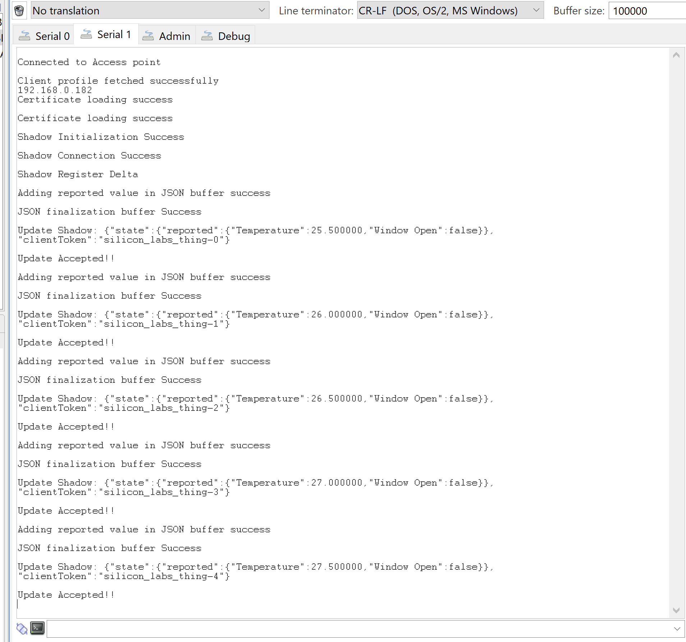
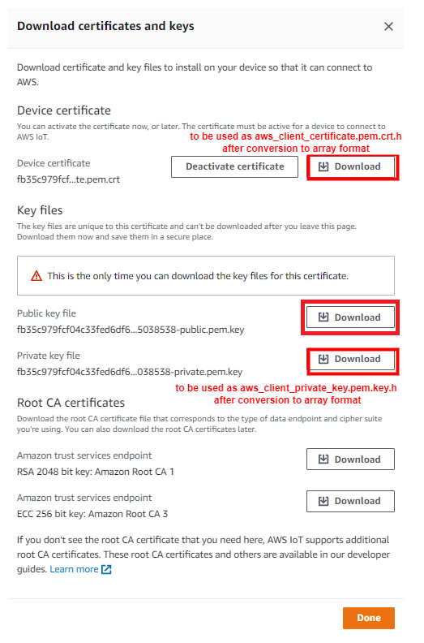

# AWS Device Shadow

## 1 Purpose/Scope

This application demonstrates how to securely connect a Silicon Labs Si91x Wi-Fi device to AWS IoT Core to send and receive data. 

To successfully use this application, developer should be familiar with the operation of [AWS IoT Core](https://docs.aws.amazon.com/iot/latest/developerguide/what-is-aws-iot.html) and the [AWS IoT Device Shadow Service](https://docs.aws.amazon.com/iot/latest/developerguide/iot-device-shadows.html). If you are new to AWS IoT Core, we recommend running through the [AWS IoT Core Tutorial](https://docs.aws.amazon.com/iot/latest/developerguide/iot-tutorials.html) before proceeding.
In the following text, 'AWS IoT Core' is referred to as 'AWS' for brevity.

AWS refer 'Device Shadow' as a persistent, virtual representation of a device that can be accessed even if the physical device is offline. The device state is captured in its 'shadow' and is represented as a JSON document. The physical device can send commands using the MQTT protocol to get, update and delete the state of the shadow as well as receive notifications via MQTT about changes in the state pf the shadow.

The AWS IoT Device Shadow application publishes temperature and window open/close status on the topic `$aws/things/thingname/shadow/update`.
The room temperature and the window open/close status is available on the AWS cloud.

Additionally, the application subscribes to the shadow update topics:

```sh
  $aws/things/thingName/shadow/name/shadowName/update/accepted
  $aws/things/thingName/shadow/name/shadowName/update/rejected
  $aws/things/thingName/shadow/name/shadowName/update/delta
```

## Overview of AWS SDK

AWS IoT Core is a cloud platform which connects devices across AWS cloud services. AWS IoT provides a interface which allows the devices to communicate securely and reliably in bi-directional ways to the AWS touch-points, even when the devices are offline.

The AWS IoT Device SDK allow applications to securely connect to the AWS IoT platform.
 


## 2 Prerequisites/Setup Requirements

### 2.1 Hardware Requirements  

- Windows PC
- Wi-Fi Access point with a connection to the internet
- **SoC Mode**:
  - Silicon Labs [BRD4325A, BRD4325B, BRD4325G](https://www.silabs.com/)
- **NCP Mode**:
  - Silicon Labs [(BRD4180A, BRD4280B)](https://www.silabs.com/) **AND**
  - Host MCU Eval Kit. This example has been tested with:
    - Silicon Labs [WSTK + EFR32MG21](https://www.silabs.com/development-tools/wireless/efr32xg21-bluetooth-starter-kit) 

### 2.2 Software Requirements

- Simplicity Studio IDE 

  - Download the latest [Simplicity Studio IDE](https://www.silabs.com/developers/simplicity-studio)
  - Follow the [Simplicity Studio user guide](https://docs.silabs.com/simplicity-studio-5-users-guide/1.1.0/ss-5-users-guide-getting-started/install-ss-5-and-software#install-ssv5) to install Simplicity Studio IDE

### 2.3 Setup Diagram

#### SoC Mode 


  
Follow the [Getting Started with SiWx91x SoC](https://docs.silabs.com/) guide to set up the hardware connections and Simplicity Studio IDE.

#### NCP Mode  


Follow the [Getting Started with EFx32](https://docs.silabs.com/rs9116-wiseconnect/latest/wifibt-wc-getting-started-with-efx32/) guide to setup the hardware connections and Simplicity Studio IDE.

**NOTE**: 

- The Host MCU platform (EFR32MG21) and the SiWx91x interact with each other through the SPI interface. 

## 3 Project Environment

- Ensure the SiWx91x loaded with the latest firmware following the [Getting started with a PC](https://docs.silabs.com/rs9116/latest/wiseconnect-getting-started)

### 3.1 Creating the project

#### 3.1.1 SoC mode

- In the Simplicity Studio IDE, the SiWx91x SoC board will be detected under **Debug Adapters** pane as shown below.

 ****

- Studio should detect your board. Your board will be shown here. Click on the board detected and go to **EXAMPLE PROJECTS & DEMOS** section.

- Filter for Wi-Fi examples from the Gecko SDK added. For this, check the *Wi-Fi* checkbox under **Wireless Technology** 

 ****

- Click 'Create'. The "New Project Wizard" window appears. Click 'Finish'

 ****

#### 3.1.2 NCP mode

- In the Simplicity Studio IDE, the EFR32 board will be detected under **Debug Adapters** pane as shown below.

    ****

- Ensure the latest Gecko SDK along with the WiSeConnect3 extension is added to Simplicity Studio.

- Go to the 'EXAMPLE PROJECT & DEMOS' tab and select Wi-Fi - NCP AWS Device Shadow application

 ****

- Click 'Create'. The "New Project Wizard" window appears. Click 'Finish'

 ****

### 3.2 Set up for application prints

#### 3.2.1 SoC mode

You can use either of the below USB to UART converters for application prints.

1. Set up using USB to UART converter board.

- Connect Tx (Pin-6) to P27 on WSTK
- Connect GND (Pin 8 or 10) to GND on WSTK

****

2. Set up using USB to UART converter cable

- Connect RX (Pin 5) of TTL convertor to P27 on WSTK
- Connect GND (Pin1) of TTL convertor to GND on WSTK

****

**Tera Term set up - for NCP and SoC modes**

1. Open the Tera Term tool.

- For SoC mode, choose the serial port to which USB to UART converter is connected and click on **OK**. 

     ****

- For NCP mode, choose the J-Link port and click on **OK**.
    
  ****

2. Navigate to the Setup → Serial port and update the baud rate to **115200** and click on **OK**.

 ****

 ****

## 4 Application Build Environment

The application can be configured to suit your requirements and development environment. 

### 4.1 Configure the application

- Below parameters in **aws_iot_config.h** can be configured based on the AWS domain name, port, client ID and thing name. 

```c
#define AWS_IOT_MQTT_HOST     "a2m21kovu9tcsh-ats.iot.us-east-2.amazonaws.com" ///< Customer specific MQTT HOST. The same will be used for Thing Shadow
#define AWS_IOT_MQTT_PORT       8883                ///< default port for MQTT/S
#define AWS_IOT_MQTT_CLIENT_ID "silicon_labs_thing" ///< MQTT client ID should be unique for every device
#define AWS_IOT_MY_THING_NAME  "silicon_labs_thing" ///< Thing Name of the Shadow this device is associated with
```

- By default, the application connects to the remote Access point with **default_wifi_client_profile** configuration provided in **sl_net_default_values.h**

### 4.2 Build the application

- SoC mode: 

 

- NCP mode: 

### 4.3 Run and Test the application

- Once the build was successful, right click on project and click on Debug As->Silicon Labs ARM Program as shown in below image.

    

### 4.4 Application Output

- After successful execution, the device updates are written to the AWS cloud and they can be observed in the AWS thing shadow.

 

### 4.5 Additional Information

- AWS_IOT_MQTT_HOST parameter can be found as follows:

 
 
  
 
#### 4.5.1 Setting up Security Certificates

- To authenticate and securely connect with AWS, your Wi-Fi device requires a unique x.509 security certificate and private key, as well as a CA certificate which is used to verify the AWS server. Security credentials need to be converted into a C-array rather than [PEM format](https://en.wikipedia.org/wiki/Privacy-Enhanced_Mail) provided by AWS; they also need to be added to your project. 

- The WiSeConnect3 SDK provides a conversion script (written in Python 3) to make the conversion straightforward. The script is provided in the SDK 'resources' directory and is called [certificate_to_array.py](https://github.com/SiliconLabs/wiseconnect-wifi-bt-sdk/tree/master/resources/certificates/).

- To convert the device certificate and private key to C arrays, open a system command prompt and use the script as indicated in the following examples.

```sh
$> python3 certificate_to_array.py <input filename> <output arrayname>

For example:
$> python3 certificate_to_array.py d8f3a44d3f.cert.pem    aws_client_certificate
$> python3 certificate_to_array.py d8f3a44d3f.private.key aws_client_private_key
```

- After running the script on the certificate and private key, two new files are created.

```sh
aws_client_certificate.pem.crt.h
aws_client_private_key.pem.key.h
```

- Before proceeding, copy both of the new files to the WiSeConnect3 directory: `<SDK>/resources/certificates`  
Go ahead and overwrite any existing files with the same name in that directory, the originals are not needed.

- The Root CA certificate used by your Wi-Fi device to verify the AWS server is already included in the WiSeConnect3 SDK; no additional setup is required.
For reference, Amazon uses [Starfield Technologies](https://www.starfieldtech.com/) to secure the AWS website, the WiSeConnect3 SDK includes the [Starfield CA Certificate](https://github.com/SiliconLabs/wiseconnect-wifi-bt-sdk/tree/master/resources/certificates/aws_starfield_ca.pem.h).

> NOTE :
> For AWS connectivity, StarField Root CA Class 2 certificate has the highest authority being at the top of the signing hierarchy.
> 
> The StarField Root CA Class 2 certificate is an expected/required certificate which usually comes pre-installed in the operating systems and plays a key part in certificate chain verification when a device is performing TLS authentication with the IoT endpoint.
> 
> On SiWx91x device, we do not maintain the root CA trust repository due to memory constraints, so it is mandatory to load Starfield Root CA Class 2 certificate for successful mutual authentication to the AWS server.
> 
> The certificate chain sent by AWS server is as below:
> id-at-commonName=Amazon,id-at-organizationalUnitName=Server CA 1B,id-at-organizationName=Amazon,id-at-countryName=US
> id-at-commonName=Amazon Root CA 1,id-at-organizationName=Amazon,id-at-countryName=US
> id-at-commonName=Starfield Services Root Certificate Authority ,id-at-organizationName=Starfield Technologies, Inc.,id-at-localityName=Scottsdale,id-at-  stateOrProvinceName=Arizona,id-at-countryName=US)
> 
> On SiWx91x to authenticate the AWS server, firstly Root CA is validated (validate the Root CA received with the Root CA loaded on the device). Once the Root CA validation is successful, other certificates sent from the AWS server are validated.
> SiWx91x doesn't authenticate to AWS server if intermediate CA certificates are loaded instead of Starfield Root CA Class 2 certificate and would result in a Handshake error.
> StarField Root CA Class 2 certificate is at <https://certs.secureserver.net/repository/sf-class2-root.crt>
> 
> Reference links :
> <https://aws.amazon.com/blogs/security/how-to-prepare-for-aws-move-to-its-own-certificate-authority/>

#### 4.5.2 Create an AWS Thing

Create a thing in the AWS IoT registry to represent your IoT Device.

- In the [AWS IoT console](https://console.aws.amazon.com/iot/home), in the navigation pane, under Manage, choose All devices, and then choose Things.

 

- If a **You don't have any things yet** dialog box is displayed, choose **Register a thing**. Otherwise, choose **Create**.
- Click on **Create things**.

 

- On the **Create things** page, choose **Create a single thing** and click next.

 

- On the **Specify thing properties** page, enter a name for your IoT thing (for example, **Test_IoT**), and choose **Unnamed shadow (classic)** in the Device Shadow section, then choose **Next**. You can't change the name of a thing after you create it. To change a thing's name, you must create a new thing, give it the new name, and then delete the old thing.

  

- During **Configure device certificate** step, choose **Auto-generate a new certificate (recommended)** option and click next.

   

- Choose the **Download** links to download the device certificate, private key, and root CA certificate. Root CA certificate is already present in SDK (aws_starfield_ca.pem.h), and can be directly used.
  > **Warning:** This is the only instance you can download your device certificate and private key. Make sure to save them safely. 

 

- To attach an existing policy choose the policy and click on create thing, if policy is not yet created Choose Create policy and fill the fields as mentioned in the following images.

- choosing an existing policy
  
 

- creating a policy - step 1
  
 

- creating a policy - step 2 (filling the fields)
Give the **Name** to your Policy, Fill **Action** and **Resource ARN** as shown in below image, Click on **Allow** under **Effect** and click **Create** 
 

- choose the created policy and click on **Create thing**

- The created thing should now be visible on the AWS console (Manage > All devices > Things)

#### 4.5.3  Steps to create a policy from AWS console

- Navigate to **AWS IoT console**
- Choose **Policies** under **Secure**

  

- Click on **Create**
   
 

- Give the **Name** to your Policy, Fill **Action** and **Resource ARN** as shown in below image, Click on **Allow** under **Effect** and click **Create**

 
