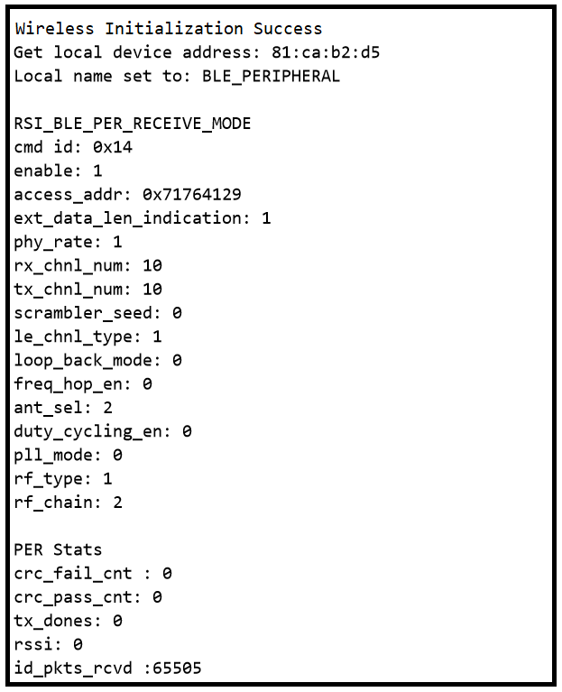

# BLE - PER

## Table of Contents

- [Purpose/Scope](#purposescope)
- [Prerequisites/Setup Requirements](#prerequisitessetup-requirements)
  - [Hardware Requirements](#hardware-requirements)
  - [Software Requirements](#software-requirements)
  - [Setup Diagram](#setup-diagram)
- [Getting Started](#getting-started)
- [Application Build Environment](#application-build-environment)
  - [Application Configuration Parameters](#application-configuration-parameters)
  - [Opermode Command Parameters](#opermode-command-parameters)
- [Test the Application](#test-the-application)

## Purpose/Scope

This application demonstrates how to configure the necessary parameters to start transmitting or receiving BLE PER packets.

## Prerequisites/Setup Requirements

Before running the application, the user will need the following things to setup.

### Hardware Requirements

- A Windows PC.
- SiWx91x Wi-Fi Evaluation Kit. The SiWx91x supports multiple operating modes. See [Operating Modes](https://www.silabs.com) for details.
- **SoC Mode**:
  - Standalone
    - BRD4002A Wireless pro kit mainboard [SI-MB4002A]
    - Radio Boards 
  	  - BRD4338A [SiWx917-RB4338A]
  	  - BRD4340A [SiWx917-RB4340A]
  - Kits
  	- SiWx917 Pro Kit [Si917-PK6031A](https://www.silabs.com/development-tools/wireless/wi-fi/siwx917-pro-kit?tab=overview)
  	- SiWx917 Pro Kit [Si917-PK6032A]
  	
- **NCP Mode**:
  - Standalone
    - BRD4002A Wireless pro kit mainboard [SI-MB4002A]
    - EFR32xG24 Wireless 2.4 GHz +10 dBm Radio Board [xG24-RB4186C](https://www.silabs.com/development-tools/wireless/xg24-rb4186c-efr32xg24-wireless-gecko-radio-board?tab=overview)
    - NCP EFR Expansion Kit with NCP Radio board (BRD4346A + BRD8045A) [SiWx917-EB4346A]
  - Kits
  	- EFR32xG24 Pro Kit +10 dBm [xG24-PK6009A](https://www.silabs.com/development-tools/wireless/efr32xg24-pro-kit-10-dbm?tab=overview)
- **PSRAM Mode**:
  - Silicon Labs [BRD4340A](https://www.silabs.com/)

- Spectrum Analyzer

### Software Requirements

- Simplicity Studio

### Setup Diagram

  

## Getting Started

Refer to the instructions [here](https://docs.silabs.com/wiseconnect/latest/wiseconnect-getting-started/) to:

- Install Studio and WiSeConnect 3 extension
- Connect your device to the computer
- Upgrade your connectivity firmware
- Create a Studio project

## Application Build Environment

### Application Configuration Parameters

The application can be configured to suit your requirements and development environment. Read through the following sections and make any changes needed.

- Open `app.c` file and update or modify following macros:

  - `RSI_CONFIG_PER_MODE` refers configuration mode BT PER TX or RX

  ```c
    #define RSI_CONFIG_PER_MODE RSI_BLE_PER_TRANSMIT_MODE
                                  OR
    #define RSI_CONFIG_PER_MODE RSI_BLE_PER_RECEIVE_MODE
  ```
  - `CMD_ID` refers the command id for transmit or receive
  
  ```c
    #define BLE_TRANSMIT_CMD_ID 0x13
    #define BLE_RECEIVE_CMD_ID  0x14
  ```
  - `PAYLOAD_TYPE` refers type of payload to be transmitted
  
  ```c
    #define DATA_PRBS9                 0x00
    #define DATA_FOUR_ONES_FOUR_ZEROES 0x01
    #define DATA_ALT_ONES_AND_ZEROES   0x02
    #define DATA_PRSB15                0x03
    #define DATA_ALL_ONES              0x04
    #define DATA_ALL_ZEROES            0x05
    #define DATA_FOUR_ZEROES_FOUR_ONES 0x06
    #define DATA_ALT_ZEROES_AND_ONES   0x07
  ```
  - `LE_CHNL_TYPE`: advertising channel - 0 data channel - 1
  
  ```c
    #define LE_ADV_CHNL_TYPE  0
    #define LE_DATA_CHNL_TYPE 1
  ```
  - `PACKET_LEN`: Length of the packet, in bytes, to be transmitted. Packet length range 0 to 255.
  
  ```c
    #define BLE_TX_PKT_LEN                32
  ```
  - `BLE_RX_CHNL_NUM`- Receive channel index, as per the Bluetooth standard.i.e, 0 to 39
  - `BLE_TX_CHNL_NUM` - Transmit channel index, as per the Bluetooth standard. i.e, 0 to 39
  
  ```c
    #define BLE_RX_CHNL_NUM 10
    #define BLE_TX_CHNL_NUM 10
  ```
  - `BLE_PHY_RATE`: ,2Mbps - 2 , 125Kbps - 4, 500Kbps - 8
  
  ```c
    #define LE_ONE_MBPS         1
    #define LE_TWO_MBPS         2
    #define LE_125_KBPS_CODED   4
    #define LE_500_KBPS_CODED   8
    #define BLE_PHY_RATE LE_ONE_MBPS
  ```
  - `SCRAMBLER_SEED`: Initial seed to be used for whitening. It should be set to '0' in order to disable whitening.
  
  ```c
    #define SCRAMBLER_SEED 0
  ```
  - `TX_MODE`: Burst mode - 0 Continuous mode - 1
  
  ```c
    #define BURST_MODE      0
    #define CONTINUOUS_MODE 1
  ```
  - `HOPPING TYPE` : no hopping -0 fixed hopping - 1 random hopping - 2
  
  ```c
    #define NO_HOPPING     0
    #define FIXED_HOPPING  1
    #define RANDOM_HOPPING 2
  ```
  - `ANT_SEL` : onchip antenna - 2 u.f.l - 3
  
  ```c
    #define ONBOARD_ANT_SEL 2
    #define EXT_ANT_SEL     3
  ```
  - `RF_TYPE` : External RF – 0 Internal RF – 1
  
  ```c
    #define BLE_EXTERNAL_RF 0
    #define BLE_INTERNAL_RF 1
  ```
  - `RF CHAIN`: Select the required RF chain
  
  ```c
    #define NO_CHAIN_SEL      0
    #define WLAN_HP_CHAIN_BIT 0
    #define WLAN_LP_CHAIN_BIT 1
    #define BT_HP_CHAIN_BIT   2
    #define BT_LP_CHAIN_BIT   3
  ```
  - `PLL MODE` : PLL_MODE0 – 0 PLL_MODE1 – 1
  
  ```c
    #define PLL_MODE_0 0
    #define PLL_MODE_1 1
  ```

  - `LOOP_BACK_MODE` : Enable 1 or Disable 0 

  ```c
    #define LOOP_BACK_MODE_ENABLE 1
    #define LOOP_BACK_MODE_DISABLE 0
  ```

- Open `ble_config.h` file and update/modify following macros,

  ```c
    #define RSI_BLE_PWR_INX                                30
    #define RSI_BLE_PWR_SAVE_OPTIONS                       BLE_DISABLE_DUTY_CYCLING
  ```

  > **Note:** `ble_config.h` files are already set with desired configuration in respective example folders user need not change for each example.
  
## Test the Application

Refer to the instructions [here](https://docs.silabs.com/wiseconnect/latest/wiseconnect-getting-started/) to:

- Build the application.
- Flash, run and debug the application.

Follow the steps as mentioned for the successful execution of the application:

1. After the program gets executed, Silicon Labs module starts BLE PER transmit or BLE PER receive.

2. The BLE-PER-RX can be validated between two SiWx91x device modes.
    - Configure a SiWx91x device in PER-TX mode and configure another SiWx91x device in BLE PER RX mode.

3. If the SiWx91x device is configured in BLE-PER-TX Mode, the SiWx91x device sends the packets with the configured mode in the configured channel.

4. Check for BLE PER stats whatever configured values are affecting or not.

5. After successful program execution the prints in Tera Term looks as shown following.

### BLE-PER-TX

  

### BLE-PER-RX

  
