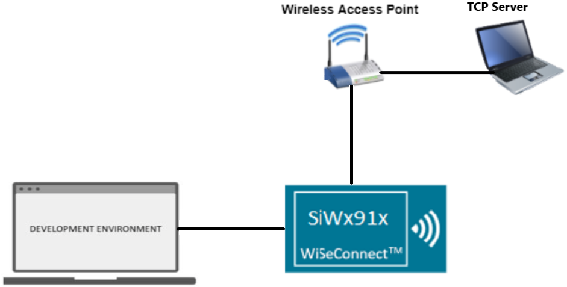

# Wi-Fi - Firmware Update

## Table of Contents

- [Purpose/Scope](#purposescope)
- [Prerequisites/Setup Requirements](#prerequisitessetup-requirements)
  - [Hardware Requirements](#hardware-requirements)
  - [Software Requirements](#software-requirements)
  - [Setup Diagram](#setup-diagram)
- [Getting Started](#getting-started)
- [Application Build Environment](#application-build-environment)
  - [Wi-Fi Client Profile Configuration](#wi-fi-client-profile-configuration)
  - [TCP Configuration](#tcp-configuration)
- [Test the Application](#test-the-application)
  - [Build and run the TCP Server](#build-and-run-the-tcp-server)

## Purpose/Scope

This application demonstrates how to update the SiWx91x firmware via Wi-Fi by downloading an image from a remote TCP server. The TCP server may be hosted on a local PC (as demonstrated in this example), or alternately on a cloud service such as Amazon AWS or Microsoft Azure. The update process works as follows:

- The SiWx91x connects via Wi-Fi as a TCP client to a TCP update server.
- The SiWx91x OTA application sends a firmware file request to the server and server responds with the firmware file.
- The OTA application programs the firmware into the SiWx91x flash memory and reboots.

## Prerequisites/Setup Requirements

### Hardware Requirements  

- PC or Mac.
- Linux PC or Cygwin on Windows (to build and run the TCP server source provided)
- Wi-Fi Access point with a connection to the internet
- **SoC Mode**:
  - Standalone
    - BRD4002A Wireless pro kit mainboard [SI-MB4002A]
    - Radio Boards 
  	  - BRD4338A [SiWx917-RB4338A]
      - BRD4339B [SiWx917-RB4339B]
  	  - BRD4340A [SiWx917-RB4340A]
      - BRD4342A [SiWx917-RB4342A]
  - Kits
  	- SiWx917 Pro Kit [Si917-PK6031A](https://www.silabs.com/development-tools/wireless/wi-fi/siwx917-pro-kit?tab=overview)
  	- SiWx917 Pro Kit [Si917-PK6032A]
  	
- **NCP Mode**:
  - Standalone
    - BRD4002A Wireless pro kit mainboard [SI-MB4002A]
    - EFR32xG24 Wireless 2.4 GHz +10 dBm Radio Board [xG24-RB4186C](https://www.silabs.com/development-tools/wireless/xg24-rb4186c-efr32xg24-wireless-gecko-radio-board?tab=overview)
    - NCP EFR Expansion Kit with NCP Radio board (BRD4346A + BRD8045A) [SiWx917-EB4346A]
  - Kits
  	- EFR32xG24 Pro Kit +10 dBm [xG24-PK6009A](https://www.silabs.com/development-tools/wireless/efr32xg24-pro-kit-10-dbm?tab=overview)

### Software Requirements

- Simplicity Studio IDE

### Setup Diagram



## Getting Started

Refer to the instructions [here](https://docs.silabs.com/wiseconnect/latest/wiseconnect-getting-started/) to:

- Install Studio and WiSeConnect 3 extension
- Connect your device to the computer
- Upgrade your connectivity firmware
- Create a Studio project

## Application Build Environment

The application can be configured to suit your requirements and development environment.

### Wi-Fi Client Profile Configuration

In the Project Explorer pane, expand the **config** folder and open the **sl_net_default_values.h** file. Configure the following parameters to enable your Silicon Labs Wi-Fi device to connect to your Wi-Fi network

- **STA instance related parameters**

- DEFAULT_WIFI_CLIENT_PROFILE_SSID refers to the name with which Wi-Fi network that shall be advertised and Si91X module is connected to it.

  	```c
  	#define DEFAULT_WIFI_CLIENT_PROFILE_SSID               "YOUR_AP_SSID"      
  	```

	- DEFAULT_WIFI_CLIENT_CREDENTIAL refers to the secret key if the Access point is configured in WPA-PSK/WPA2-PSK security modes.

  ```c
  #define DEFAULT_WIFI_CLIENT_CREDENTIAL                 "YOUR_AP_PASSPHRASE" 
  ```

- DEFAULT_WIFI_CLIENT_SECURITY_TYPE refers to the security type of the Access point. The supported security modes are mentioned in `sl_wifi_security_t`.

  ```c
  #define DEFAULT_WIFI_CLIENT_SECURITY_TYPE               SL_WIFI_WPA2 
  ```

- Other STA instance configurations can be modified if required in `default_wifi_client_profile` configuration structure.

### TCP Configuration

```c
#define SERVER_PORT        5001        // TCP server port of the remote TCP server
#define SERVER_IP_ADDRESS  "172.20.10.3"  // Server IP address 
```

### Combined Image Configuration

```c
#define COMBINED_IMAGE    0        //Set 1 for combined image upgrade and 0 for TA firmware upgrade
```

## Test the Application

Refer to the instructions [here](https://docs.silabs.com/wiseconnect/latest/wiseconnect-getting-started/) to:

- Build the application
- Flash, run and debug the application.

  

  

- When the firmware update completes, the SiWx91x should be rebooted after which it may take a few minutes to overwrite the old firmware with the new firmware in flash memory.

### Build and run the TCP Server

  1. Copy the TCP server application [firmware_update_tcp_server_9117.c](https://github.com/SiliconLabs/wiseconnect/blob/master/examples/featured/firmware_update/firmware_update_tcp_server_9117.c) provided with the application source to a Linux PC connected to the Wi-Fi access point.
  2. Compile the application

    ```c
	  user@linux:~$ gcc firmware_update_tcp_server.c -o ota_server.bin
	 ```

  3. Run the application providing the TCP port number (specified in the SiWx91x app) together with the firmware file and path where [SiWx91x.NBZ.WC.GEN.OSI.x.x.x.rps](https://github.com/SiliconLabs/wiseconnect-wifi-bt-sdk/tree/master/firmware) is the firmware image to be sent to SiWx91x.

      ```c
      user@linux:~$ ./ota_server.bin 5001 SiWx91x.NBZ.WC.GEN.OSI.x.x.x.rps
      ```