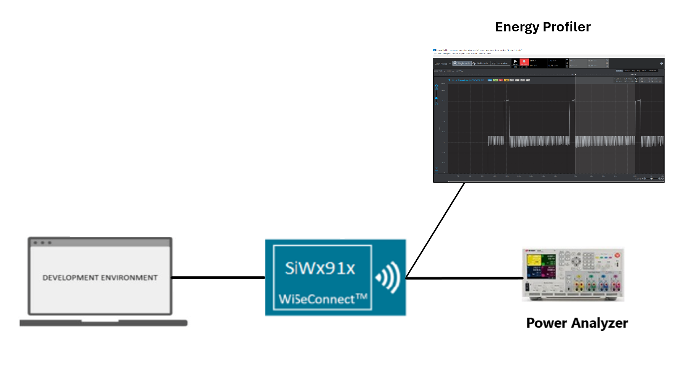
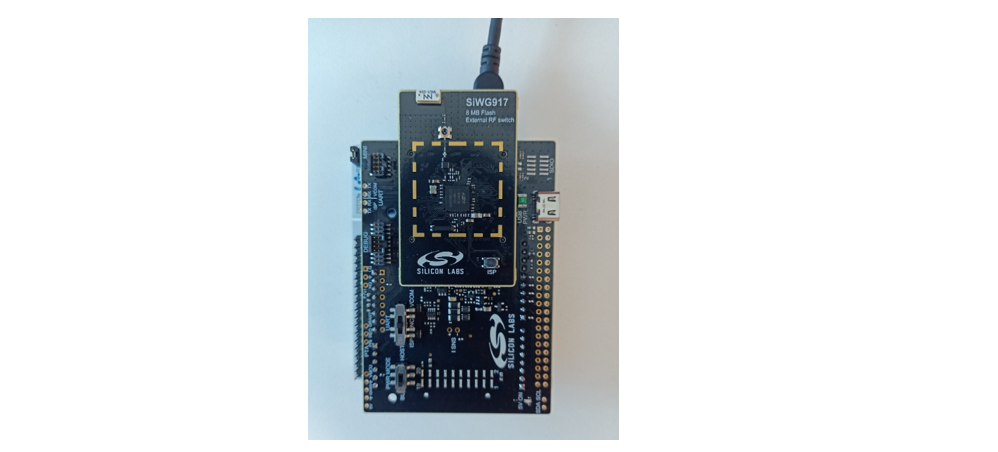

# Wi-Fi - Powersave Deep Sleep

## Table of Contents

- [Purpose/Scope](#purposescope)
- [Prerequisites/Setup Requirements](#prerequisitessetup-requirements)
  - [Hardware Requirements](#hardware-requirements)
  - [Software Requirements](#software-requirements)
  - [Set up Diagram](#set-up-diagram)
- [Getting Started](#getting-started)
- [Application Build Environment](#application-build-environment)
- [Test the Application](#test-the-application)
- [Application Output](#application-output)
- [Using Simplicity Studio Energy Profiler for Current Measurement](#using-simplicity-studio-energy-profiler-for-current-measurement)

## Purpose/Scope

This application demonstrates how to enable power save deep sleep profile with SiWx91x. This application configures the SiWx91x in standby power save mode (Unassociated mode (NWP)) without RAM retention to reduce the current consumption.

Please refer Datasheet for current consumption values without RAM retention.

## Prerequisites/Setup Requirements

### Hardware Requirements

- Windows PC
- (Optional) Power analyzer 
- **SoC Mode**:
  - Standalone
    - BRD4002A Wireless pro kit mainboard [SI-MB4002A]
    - Radio Boards 
  	  - BRD4338A [SiWx917-RB4338A]
  - Kits
  	- SiWx917 Pro Kit [Si917-PK6031A](https://www.silabs.com/development-tools/wireless/wi-fi/siwx917-pro-kit?tab=overview)
  	- SiWx917 Pro Kit [Si917-PK6032A]
  	
- **NCP Mode**:
  - Standalone
    - BRD4002A Wireless pro kit mainboard [SI-MB4002A]
    - EFR32xG24 Wireless 2.4 GHz +10 dBm Radio Board [xG24-RB4186C](https://www.silabs.com/development-tools/wireless/xg24-rb4186c-efr32xg24-wireless-gecko-radio-board?tab=overview)
    - NCP Expansion Kit with NCP Radio boards
      - (BRD4346A + BRD8045A) [SiWx917-EB4346A]
      - (BRD4357A + BRD8045A) [SiWx917-EB4357A]
  - Kits
  	- EFR32xG24 Pro Kit +10 dBm [xG24-PK6009A](https://www.silabs.com/development-tools/wireless/efr32xg24-pro-kit-10-dbm?tab=overview)
  - STM32F411RE MCU
    - [STM32F411RE](https://www.st.com/en/microcontrollers-microprocessors/stm32f411re.html) MCU
    - NCP Expansion Kit with NCP Radio boards
      - (BRD4346A + BRD8045C)
      - (BRD4357A + BRD8045C)
  - Interface and Host MCU Supported
    - SPI - EFR32 & STM32
    - UART - EFR32

### Software Requirements

- Simplicity Studio IDE (to be used with Silicon Labs MCU)
- Keil IDE (to be used with STM32F411RE MCU)
- Serial Terminal - [Docklight](https://docklight.de/)/[Tera Term](https://ttssh2.osdn.jp/index.html.en) (to be used with Keil IDE)

### Set up Diagram

  

## Getting Started

### Instructions for Simplicity Studio IDE and Silicon Labs devices (SoC and NCP Modes)

  Refer to the instructions [here](https://docs.silabs.com/wiseconnect/latest/wiseconnect-getting-started/) to:

  - Install Studio and WiSeConnect 3 extension
  - Connect your device to the computer
  - Upgrade your connectivity firmware
  - Create a Studio project
  
For details on the project folder structure, see the [WiSeConnect Examples](https://docs.silabs.com/wiseconnect/latest/wiseconnect-examples/#example-folder-structure) page.

### Instructions for Keil IDE and STM32F411RE MCU (NCP Mode)

  - Install the [Keil IDE](https://www.keil.com/).
  - Download [WiSeConnect 3 SDK](https://github.com/SiliconLabs/wiseconnect)
  - Update the device's connectivity firmware as mentioned [here](https://docs.silabs.com/wiseconnect/latest/wiseconnect-getting-started/getting-started-with-ncp-mode).
  - Connect the SiWx91x NCP to STM32F411RE Nucleo Board following the below steps:
   - Connect the male Arduino compatible header on carrier board to female Arduino compatible header on STM32F411RE Nucleo board.
   - Mount the NCP Radio board (BRD4346A/BRD4357A) onto the radio board socket available on the base board (BRD8045C).
   - After connecting all the boards, the setup should look like the image shown below:
    
   - Connect the setup to the computer.
  - Open the POWERSAVE DEEP SLEEP µVision project - **power_save_deep_sleep.uvprojx** by navigating to **WiSeConnect 3 SDK → examples → featured → low_power → power_save_deep_sleep → keil_project**. 

## Application Build Environment

**Soc Mode**:

The M4 processor is set in sleep mode. The M4 processor can be woken in several ways as mentioned below:

- ALARM timer-based - In this method, an ALARM timer is run that wakes the M4 processor up periodically as configured in the Universal Configurator in 'Wakeup Source Configuration' under `WiseConnect 3 SDK v3.1.3 -> Device -> MCU -> Service -> Power Manager -> ULP Peripheral -> Wakeup Source Configuration` as shown below

  

  

## Test the Application

### Instructions for Simplicity Studio IDE and Silicon Labs devices (SoC and NCP Modes)

Refer to the instructions [here](https://docs.silabs.com/wiseconnect/latest/wiseconnect-getting-started/) to:

- Build the application.
- Flash, run and debug the application.

### Instructions for Keil IDE and STM32F411RE MCU

- Build the application.
- Set the Docklight up by connecting STM32's Serial COM port. This enables you to view the application prints.
- Flash, run and debug the application.

## Application Output

  
  
  

### Using Simplicity Studio Energy Profiler for Current Measurement
  
- After flashing the application code to the module. Energy profiler can be used for current consumption measurements.

- From tools, choose Energy Profiler and click "OK".

    

- From Quick Access, choose Start Energy Capture option

    

    > **Note** The target part and board name have to be reverted to default to flash application binary.
- Select board and click Okay

  
- Average current consumption measured in power-meter

    

> **Note:**
> - The reference images which are captured are measured in isolated chamber, might vary in open environment.
> - To achieve the lowest power numbers in unconnected sleep, in SoC mode,one should configure both NWP and M4 to sleep without RAM retention.
> - To achieve the datasheet number for the deepsleep with 352k RAM retained one should configure `RAM_LEVEL` to `SL_SI91X_RAM_LEVEL_NWP_BASIC_MCU_ADV` and M4 to sleep without RAM retention.
> - A flash erase is required to flash any other application after the user runs the powersave application(s). If not, the module will not allow any application to be flashed.
