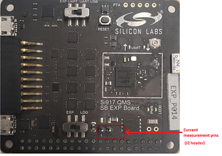
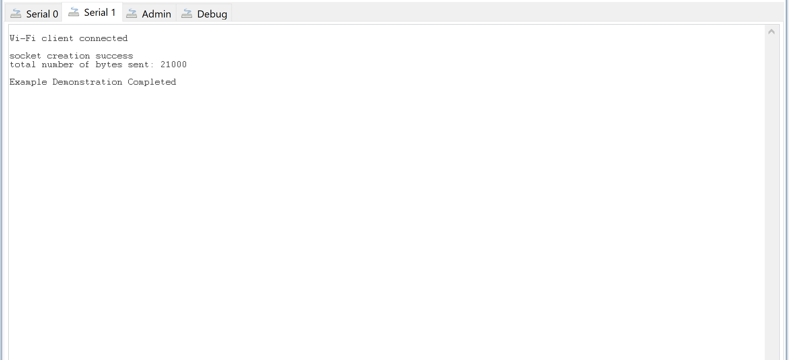
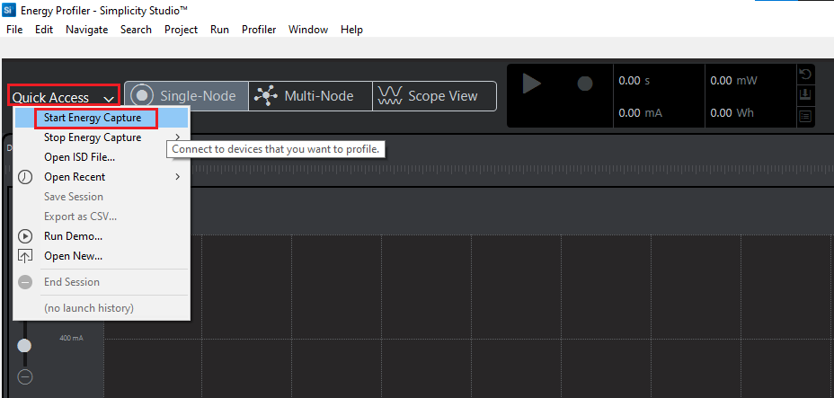

# Wi-Fi - Powersave Standby Associated

## Table of Contents

- [Purpose/Scope](#purposescope)
- [Prerequisites/Setup Requirements](#prerequisitessetup-requirements)
  - [Hardware Requirements](#hardware-requirements)
  - [Software Requirements](#software-requirements)
  - [Setup Diagram](#setup-diagram)
- [Getting Started](#getting-started)
- [Application Build Environment](#application-build-environment)
- [Test the Application](#test-the-application)
  - [Run the iPerf Server](#run-the-iperf-server)
  - [Using Simplicity Studio Energy Profiler for Current Measurement](#using-simplicity-studio-energy-profiler-for-current-measurement)

## Purpose/Scope

This application demonstrates the process for configuring the SiWx91x in ASSOCIATED_POWER_SAVE mode, also providing the steps to configure the SiWx91x EVK in station mode and initiate a connection to an Access Point. When the module is in deep sleep, it wakes up in periodic intervals based on DTIM or Listen Interval.

The application connects to a remote server to send UDP data and also enables the analysis of various performance profiles using a power analyzer during the ASSOCIATED_POWER_SAVE with data transfer via UDP.

## Prerequisites/Setup Requirements

### Hardware Requirements  

- Windows PC
- Wi-Fi Access point with a connection to the internet
- PC2 (Remote PC) with UDP server application (iPerf)
- Power analyzer

- **SoC Mode**:
  - Standalone
    - BRD4002A Wireless pro kit mainboard [SI-MB4002A]
    - Radio Boards 
  	  - BRD4338A [SiWx917-RB4338A]
  	  - BRD4340A [SiWx917-RB4340A]
  - Kits
  	- SiWx917 Pro Kit [Si917-PK6031A](https://www.silabs.com/development-tools/wireless/wi-fi/siwx917-pro-kit?tab=overview)
  	- SiWx917 Pro Kit [Si917-PK6032A]
  	
- **NCP Mode**:
  - Standalone
    - BRD4002A Wireless pro kit mainboard [SI-MB4002A]
    - EFR32xG24 Wireless 2.4 GHz +10 dBm Radio Board [xG24-RB4186C](https://www.silabs.com/development-tools/wireless/xg24-rb4186c-efr32xg24-wireless-gecko-radio-board?tab=overview)
    - NCP EFR Expansion Kit with NCP Radio board (BRD4346A + BRD8045A) [SiWx917-EB4346A]
  - Kits
  	- EFR32xG24 Pro Kit +10 dBm [xG24-PK6009A](https://www.silabs.com/development-tools/wireless/efr32xg24-pro-kit-10-dbm?tab=overview)
  - Current consumption measurement pins for using power-meter (NCP mode):

    

    Negative probe of power meter is used for pin-1 and positive probe is used for pin-2

### Software Requirements

- Simplicity Studio IDE
- [iPerf Application](https://iperf.fr/iperf-download.php)
- [Python Environment](https://www.python.org/downloads/)

### Setup Diagram

  
  
## Getting Started

Refer to the instructions [here](https://docs.silabs.com/wiseconnect/latest/wiseconnect-getting-started/) to:

- Install Studio and WiSeConnect 3 extension
- Connect your device to the computer
- Upgrade your connectivity firmware
- Create a Studio project

## Application Build Environment

The application can be configured to suit your requirements and development environment.

- In the Project Explorer pane, expand the **config** folder and open the **sl_net_default_values.h** file. Configure the following parameters to enable your Silicon Labs Wi-Fi device to connect to your Wi-Fi network.

- STA instance related parameters:

    - DEFAULT_WIFI_CLIENT_PROFILE_SSID refers to the name with which Wi-Fi network that shall be advertised and Si91X module is connected to it.

    ```c
    #define DEFAULT_WIFI_CLIENT_PROFILE_SSID               "YOUR_AP_SSID"      
    ```

  - DEFAULT_WIFI_CLIENT_CREDENTIAL refers to the secret key if the Access point is configured in WPA-PSK/WPA2-PSK security modes.

    ```c
    #define DEFAULT_WIFI_CLIENT_CREDENTIAL                 "YOUR_AP_PASSPHRASE" 
    ```

  - DEFAULT_WIFI_CLIENT_SECURITY_TYPE refers to the security type of the Access point. The supported security modes are mentioned in `sl_wifi_security_t`.

    ```c
    #define DEFAULT_WIFI_CLIENT_SECURITY_TYPE              SL_WIFI_WPA2
    ```

- Other STA instance configurations can be modified if required in `default_wifi_client_profile` configuration structure.

- Configure the following parameters in **app.c** to test throughput app as per requirements
  - `SERVER_PORT` is the remote UDP server port number on the PC running iPerf.
  - `SERVER_IP_ADDRESS` is the remote UDP server IP address on the PC running iPerf.
  - `NUMBER_OF_PACKETS` controls the number of packets sent to the remote UDP server.

      ```c
      #define SERVER_IP_ADDRESS   "192.168.0.198"
      #define SERVER_PORT         5656
      #define NUMBER_OF_PACKETS   1000
      ```

 - User can configure monitor interval through sl_wifi_set_performance_profile() API. The default interval is set to 50 
   millisecs if montior_interval is set to 0. This is only valid when performance profile is set to ASSOCIATED_POWER_SAVE_LOW_LATENCY.
 - User can configure listen interval through sl_wifi_set_listen_interval() API. The default interval is set to 1 
   millisec.

## Test the Application

Refer to the instructions [here](https://docs.silabs.com/wiseconnect/latest/wiseconnect-getting-started/) to:

- Build the application.
- Flash, run and debug the application.

    

### Run the iPerf Server

- Start a UDP server using the following command in command prompt.

  > `C:\ iperf.exe –s -u -p <SERVER_PORT> -i 1`

    

  > If the iPerf server does not start and gives an error in the form of "Access Denied", the user can resolve this error by running the command prompt as an administrator.

- When the powersave application runs, SiWx91x scans and connect to the Wi-Fi access point and obtains an IP address. After a successful connection, the device goes into configured power save and sends configured number of UDP packets to the remote peer which is connected to access point. The following image shows active reception of UDP data on the UDP server.

    


### Using Simplicity Studio Energy Profiler for Current Measurement
  
- After flashing the application code to the module. Energy profiler can be used for current consumption measurements.

- From tools, choose Energy Profiler and click "OK".

    

- From Quick Access, choose Start Energy Capture option

    

    > **Note** The target part and board name have to be reverted to default to flash application binary.

  
- Average current consumption measured in power-meter

    

> **Note:**
> - The measured current may vary if the scenario is performed in open environment. AP to AP variation is also observed.
> - To achieve the lowest power numbers in connected sleep, in SoC mode, one should configure `RAM_LEVEL` to `SL_SI91X_RAM_LEVEL_NWP_BASIC_MCU_ADV` and M4 to without RAM retention i.e. `sl_si91x_configure_ram_retention` should not be done.
> - A flash erase is required to flash any other application after the user runs the powersave application(s). If not, the module will not allow any application to be flashed.

**Soc Mode**:

The M4 processor is set in sleep mode. The M4 processor can be woken in several ways as mentioned in following points:

- ALARM timer-based - In this method, an ALARM timer is run that wakes the M4 processor up periodically every **ALARM_PERIODIC_TIME** time period.
  - We can enable the ALARM timer-wakeup by adding the preprocessor macro "SL_SI91X_MCU_ALARM_BASED_WAKEUP" for the example.
  - In the Project explorer pane, expand as follows wiseconnect3_sdk_xxx > components > device > silabs > si91x > mcu > drivers > peripheral_drivers > src folder and open sl_si91x_m4_ps.c file. Configure **ALARM_PERIODIC_TIME**, in seconds, in sl_si91x_m4_ps.c
- Button press-based (GPIO) - In this method, the M4 processor wakes up upon pressing a button (BTN0).
  - We can enable the Button press-based wakeup by adding the preprocessor macro "SL_SI91X_MCU_BUTTON_BASED_WAKEUP" for the example.
- Wireless-based - When an RX packet is to be received by the TA, the M4 processor is woken up.
  - We can enable the Wireless-wakeup by adding the preprocessor macro "SL_SI91X_MCU_WIRELESS_BASED_WAKEUP" for the example.