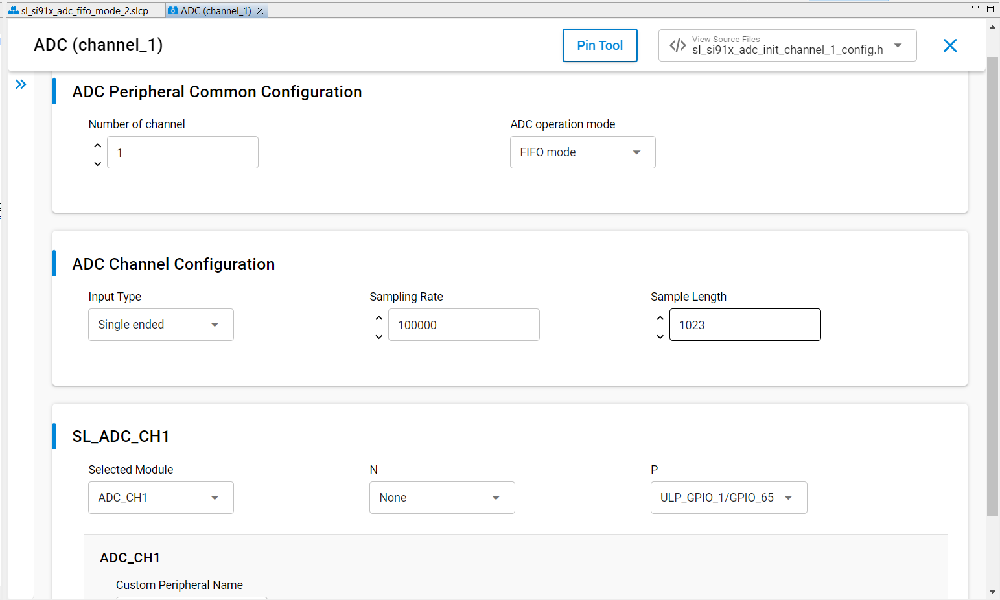
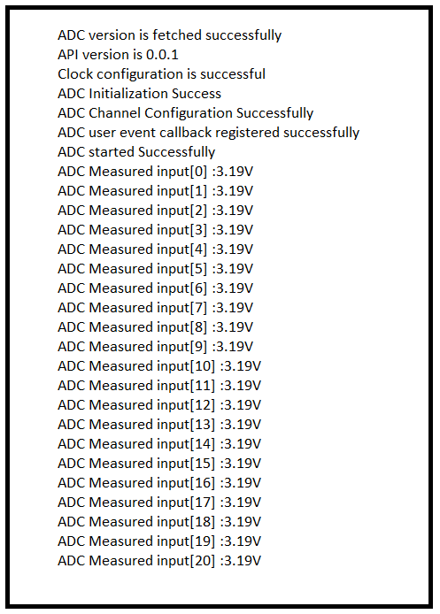

# SL ADC FIFO Mode

## Table of Contents

- [Purpose/Scope](#purposescope)
- [Overview](#overview)
- [About Example Code](#about-example-code)
- [Prerequisites/Setup Requirements](#prerequisitessetup-requirements)
  - [Hardware Requirements](#hardware-requirements)
  - [Software Requirements](#software-requirements)
  - [Setup Diagram](#setup-diagram)
- [Getting Started](#getting-started)
- [Application Build Environment](#application-build-environment)
  - [Application Configuration Parameters](#application-configuration-parameters)
  - [Pin Configuration](#pin-configuration)
- [Test the Application](#test-the-application)

## Purpose/Scope

- This application demonstrate the ADC peripheral,
  - Conversion of analog input to 12-bit digital output.
  - Samples the data.
  - Convert data into equivalent input voltage based on operation mode.

## Overview

- The ADC Controller works on a ADC with a resolution of 12bits at 10Msps when ADC reference Voltage is greater than 2.8v or 5Msps when ADC reference Voltage is less than 2.8v.
- Sample application will be 12 bit ADC Output in 2's complement representation.
- There are two operating mode in AUX ADC controller:
  - Static Mode Operation: ADC data input will be sampled and written to a register in this mode.
  - FIFO Mode Operation: ADC data input will be sampled and written to the ADC FIFO in this mode.
- There is a dedicated ADC DMA to support 16 channels.
- DMA mode supports dual buffer cyclic mode to avoid loss of data when buffer is full. In dual buffer cyclic mode, if buffer 1 is full for particular channel, incoming sampled
  data is written into buffer 2 such that, samples from buffer 1 are read back by controller during this time. That’s why there are two start addresses, two buffer lengths and
  two valid signals for each channel.
- External event-based sampling support.
- Multi-channel mode, as the multiple channels are sensed, after sensing each channel, information related to “buffer length” etc. of that particular channel are rewritten
  in to the corresponding location of internal memory for the next use when same channel is sensed again.
- External triggers can be used in PS4 State to collect the sample from a pre-defined channel.
- The AUX ADC can take analog inputs in single ended or differential. The output is 12-bit digital which can be given out with (or) without noise averaging.
- The Aux VRef can be connected directly to Vbat (Aux LDO bypass mode) or to the Aux LDO output.

## About Example Code

- This example demonstrates ADC in FIFO mode of operation. It reads the sampled data from specific channel buffer of ADC and convert it into equivalent input voltage.
- Various parameters like Number of channel, ADC operation mode, Input Type, Sampling Rate and Sample Length can be configured using UC.
- sl_si91x_adc_common_config.h file contains the common configurations for ADC and sl_si91x_adc_init_inst_config.h contains channel instance configuration.
- This example is working on ADC FIFO mode and it sample the data using dma.
- Firmware version of API is fetched using \ref sl_si91x_adc_get_version which includes release version, major version and minor version \ref sl_adc_version_t.
- ADC initialize should call \ref sl_si91x_adc_init API and passing parameters \ref sl_adc_channel_config_t, \ref sl_adc_config_t and reference voltage value.
- All the necessary parameters are configured using \ref sl_si91x_adc_set_channel_configuration API, it expects a structure with required parameters \ref sl_adc_channel_config_t and \ref sl_adc_config_t.
- After configuration, a callback register API is called to register the callback at the time of events \ref sl_si91x_adc_register_event_callback.
- Then start the ADC to sample the data using \ref sl_si91x_adc_start API.
- Once sampling is done callback will hit and set the true "data_sample_complete_flag" flag to read the sampled data using \ref sl_si91x_adc_read_data API for FIFO mode of ADC. This process will run continuously.

## Prerequisites/Setup Requirements

### Hardware Requirements

- Windows PC
- Silicon Labs Si917 Evaluation Kit [WPK(BRD4002)+ BRD4338A / BRD4342A / BRD4343A ]

### Software Requirements

- Simplicity Studio
- Serial console Setup
  - The Serial Console setup instructions are provided below:
Refer [here](https://docs.silabs.com/wiseconnect/latest/wiseconnect-developers-guide-developing-for-silabs-hosts/#console-input-and-output)

### Setup Diagram

> 

## Getting Started

Refer to the instructions [here](https://docs.silabs.com/wiseconnect/latest/wiseconnect-getting-started/) to:

- Install Studio and WiSeConnect 3 extension
- Connect your device to the computer
- Upgrade your connectivity firmware
- Create a Studio project

For details on the project folder structure, see the [WiSeConnect Examples](https://docs.silabs.com/wiseconnect/latest/wiseconnect-examples/#example-folder-structure) page.

## Application Build Environment

### Application Configuration Parameters

- Configure UC from the slcp component.
- Open **sl_si91x_adc_fifo_mode.slcp** project file select **software component** tab and search for **ADC** in search bar.
- Using configuration wizard one can configure different parameters. The configuration screen is below, with options for the user to pick based on need.

  - **ADC Peripheral Common Configuration**

    - Number of channel: By default channel is set to '1'. When the channel number is changed, then care must be taken to create instance of that respective channel number. Otherwise, an error is thrown.
    - ADC operation mode: There are 2 modes, FIFO mode and Static mode. By default it is in FIFO mode. When static mode is set, sample length should be '1'.

  - **ADC Channel Configuration**

    - Input Type: ADC input type can be configured to either single ended (or) differential.
    - Sampling rate: Sample rate can be configurable to ADC channel, sample rate unit is samples/second. The configuration range from 1sps to 2.5 Msps.
    - Sample length: Set the length of ADC samples, i.e. number of ADC samples collected for operation, it should be minimum value set to 1 and maximum of 1023.

      

- After running the application it will store the equivalent input voltage from ADC output samples in 'vout'.
- ADC output will print configured number of samples output voltage on UART console
- Apply the different voltages(1.8V to Vref) to ADC input and observe console outputs as per input.
- Provided input voltage and console output data should match.

### Pin Configuration

- Here mentioned pin numbers for BRD4338a (B0 2.0v boards), if user want to use different radio board, refer to board specific user guide.

  | CHANNEL | PIN TO ADCP | PIN TO ADCN |
  | --- | --- | --- |
  | 1 | ULP_GPIO_1 [P16] | GPIO_28 [P31]  |
  | 2 | ULP_GPIO_10 [P17] | GPIO_30 [P35] |
  | 3 | ULP_GPIO_8 [P15] | GPIO_26 [P27] |
  | 4 | GPIO_25 [P25] | ULP_GPIO_7 [EXP_HEADER-15] |
  | 5 | ULP_GPIO_8 [P15] | ULP_GPIO_1 [P16] |
  | 6 | ULP_GPIO_10 [P17] | ULP_GPIO_7 [EXP_HEADER-15] |
  | 7 | GPIO_25 [P25] | GPIO_26 [P27] |
  | 8 | GPIO_27 [P29] | GPIO_28 [P31] |
  | 9 | GPIO_29 [P33] | GPIO_30 [P35] |
  | 10 | GPIO_29 [P33] | GPIO_30 [P35] |
  | 11 | ULP_GPIO_1 [P16] | GPIO_30 [P35] |
  | 12 | ULP_GPIO_1 [P16] | GPIO_28 [P31] |
  | 13 | ULP_GPIO_7 [EXP_HEADER-15] | GPIO_26 [P27] |
  | 14 | GPIO_26 [P27] | ULP_GPIO_7 [EXP_HEADER-15] |
  | 15 | GPIO_28 [P31] | GPIO_26 [P27] |
  | 16 | GPIO_30 [P35] | ULP_GPIO_7 [EXP_HEADER-15] |

  | OTHER INPUT SELECTION | VALUE TO ADCP | VALUE TO ADCN |
  | --- | --- | --- |
  | OPAMP1_OUT            |         20    |     10        |
  | OPAMP2_OUT            |         21    |     11        |
  | OPAMP3_OUT            |         22    |     12        |
  | TEMP_SENSOR_OUT       |         23    |     --        |
  | DAC_OUT               |         24    |     13        |

## Test the Application

Refer to the instructions [here](https://docs.silabs.com/wiseconnect/latest/wiseconnect-getting-started/) to:

1. Compile and run the application.
2. While generating the project by default channel_1 instance will create for this channel_1 follow below two sub-points on B0 board.
   - Single ended mode give the positive analog input to ULP_GPIO_1
   - Differential mode give positive analog input to ULP_GPIO_1 and negative input to GPIO_28
3. When the application runs, the ADC configure the settings as per the user and start ADC conversion.
4. After completion of conversion ADC input, it will print all the captured samples data in console by connecting serial console.
5. After successful program execution the prints in serial console looks as shown below when the input voltage provided is 3.25v(approx).

    

> **Note:**
>
>- User can configure input selection GPIO in example application if default GPIO is work around
>- ADC input selection rather than GPIO (like OP-AMP, DAC and Temperature sensor) user can create their own instances and configure them as per other input selection.
>- The dac component needs to be installed in order to verify the support for 5 MHz ADC-DAC without losing samples.
>- In the adc_fifo_mode_example.c file, update the \ref sl_adc_channel_config_t channel parameter to reflect the installed channel number.
>
 Use following formula to find equivalent input voltage of ADC
>
> **Differential Ended Mode:**
>
> vout = ((((float)ADC output/(float)4096) * Vref Voltage) - (Vref Voltage/2));
>
> > **Note:** If Positive input to ADC given as 2.4V and Negative > > input given as 1.5V then ADC output will be digital value which is equivalent to 0.9V
>
> **Single ended Mode:**
>
> vout = (((float)ADC output/(float)4096) * Vref Voltage);
>
> > **Note:** If Positive input to ADC given as 2.4V then ADC output will be digital value which is equivalent to 2.4V

> **Note:**
>
> - Interrupt handlers are implemented in the driver layer, and user callbacks are provided for custom code. If you want to write your own interrupt handler instead of using the default one, make the driver interrupt handler a weak handler. Then, copy the necessary code from the driver handler to your custom interrupt handler.
