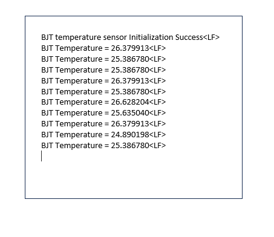

# SL BJT TEMPERATURE SENSOR

## Table of Contents

- [Purpose/Scope](#purposescope)
- [Overview](#overview)
- [Prerequisites/Setup Requirements](#prerequisitessetup-requirements)
  - [Hardware Requirements](#hardware-requirements)
  - [Software Requirements](#software-requirements)
  - [Setup Diagram](#setup-diagram)
- [Getting Started](#getting-started)
- [Application Build Environment](#application-build-environment)
  - [Application Configuration Parameters](#application-configuration-parameters)
  - [Pin Configuration](#pin-configuration)
- [Test the Application](#test-the-application)

## Purpose/Scope

- This application demonstrate the BJT temperature sensor peripheral,
  - Conversion of 12-bit digital output into temperature in the range of -40 to 125 degree celsius.

## Overview

- BJT Temperature Sensor is useful to read the temperature by enabling the temperature sensor.
- The range it can read is from -40 to 125 degree celsius. Depending upon the digital output.
- voltage reference can be taken from 1.8 to 3.3 volts.
- When the application runs, the ADC configuration configures ADC.
- After the successful configuration of ADC, bandgap configuration read the OPAMP1 data.  
- Then BJT configure will enable the temperature sensor and reads the data. 
- By taking the calibrated data from adc_off, voltage band gap and voltage offset we are calculating the temperature value.
- After completion of conversion digital output, it will map to temperature conversion and then it will print all the captured samples data in console by connecting serial console.

## Prerequisites/Setup Requirements

### Hardware Requirements

- Windows PC
- Silicon Labs Si917 Evaluation Kit [WPK(BRD4002)+ BRD4338A / BRD4342A / BRD4343A ]

### Software Requirements

- Simplicity Studio
- Serial console Setup
  - For Serial Console setup instructions, refer [here](https://docs.silabs.com/wiseconnect/latest/wiseconnect-developers-guide-developing-for-silabs-hosts/#console-input-and-output).

### Setup Diagram

> 

## Getting Started

Refer to the instructions [here](https://docs.silabs.com/wiseconnect/latest/wiseconnect-getting-started/) to:

- Install Studio and WiSeConnect 3 extension
- Connect your device to the computer
- Upgrade your connectivity firmware
- Create a Studio project

For details on the project folder structure, see the [WiSeConnect Examples](https://docs.silabs.com/wiseconnect/latest/wiseconnect-examples/#example-folder-structure) page.

## Application Build Environment

### Application Configuration Parameters

- Configure the following parameters in sl_si91x_bjt_temperature_sensor.c (components\device\silabs\si91x\mcu\drivers\unified_api\src) file and update/modify following macros if required

  ```c
  #define CHANNEL_NUMBER             0       // channel number for adc
  #define POS_IP_OPAMP               20      // Positive input to ADC using OPAMP
  #define OPAMP_GAIN_OPAMP           51      // OPAMP gain value if opamp output is one of input to ADC
  #define OPAMP_CHANNEL              0       // opamp channel initializing with 0
  ```

### Pin Configuration

- Here mentioned pin numbers for BRD4338a (B0 2.0v boards) firmware version 18 board if user want to use different radio board, refer to board specific user guide.

  | INPUT SELECTION       | VALUE TO ADCP |
  | --------------        | ------------  |
  | OPAMP1_OUT            |         20    |     
  | OPAMP2_OUT            |         21    |
  | OPAMP3_OUT            |         22    |
  | TEMP_SENSOR_OUT       |         23    |

## Test the Application

Refer to the instructions [here](https://docs.silabs.com/wiseconnect/latest/wiseconnect-getting-started/) to:

1. Compile and run the application.
2. After successful program execution the prints in serial console looks as shown below.

    


> **Note:**
>
> - Interrupt handlers are implemented in the driver layer, and user callbacks are provided for custom code. If you want to write your own interrupt handler instead of using the default one, make the driver interrupt handler a weak handler. Then, copy the necessary code from the driver handler to your custom interrupt handler.
