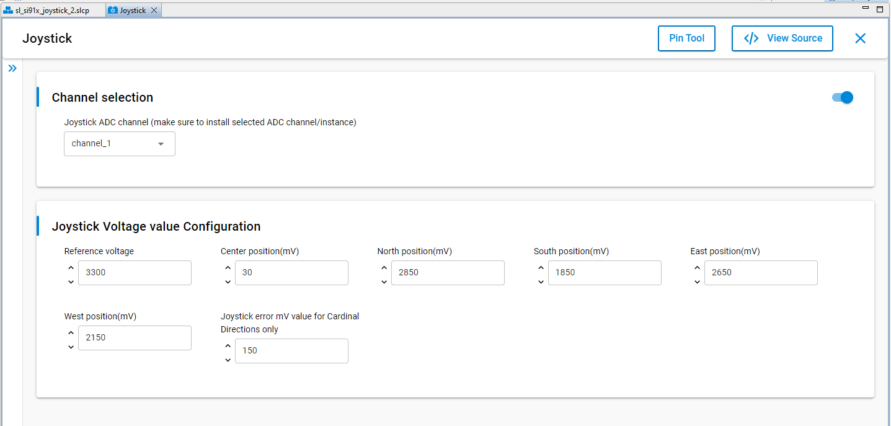
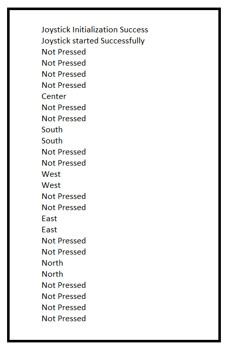

# SL JOYSTICK

## Table of Contents

- [Purpose/Scope](#purposescope)
- [Prerequisites/Setup Requirements](#prerequisitessetup-requirements)
  - [Hardware Requirements](#hardware-requirements)
  - [Software Requirements](#software-requirements)
  - [Setup Diagram](#setup-diagram)
- [Getting Started](#getting-started)
- [Application Build Environment](#application-build-environment)
  - [Application Configuration Parameters](#application-configuration-parameters)
  - [Joystick on BRD4002A](#joystick-on-brd4002a)
- [Test the Application](#test-the-application)

## Purpose/Scope

This sample app demonstrates the use of the Joystick Driver. It prints the joystick position after every finite interval over serial console

## Prerequisites/Setup Requirements

### Hardware Requirements

- Windows PC
- Silicon Labs Si917 Evaluation Kit [WPK(BRD4002) + BRD4338A]

### Software Requirements

- Simplicity Studio
- Serial console Setup
  - The Serial Console setup instructions are provided below:
Refer [here](https://docs.silabs.com/wiseconnect/latest/wiseconnect-developers-guide-developing-for-silabs-hosts/#console-input-and-output)

### Setup Diagram

> 

## Getting Started

Refer to the instructions [here](https://docs.silabs.com/wiseconnect/latest/wiseconnect-getting-started/) to:

- Install Studio and WiSeConnect 3 extension
- Connect your device to the computer
- Upgrade your connectivity firmware
- Create a Studio project

For details on the project folder structure, see the [WiSeConnect Examples](https://docs.silabs.com/wiseconnect/latest/wiseconnect-examples/#example-folder-structure) page.

## Application Build Environment

### Application Configuration Parameters

- Configure UC from the slcp component.
- Open **sl_si91x_joystick.slcp** project file select **software component** tab and search for **joystick** in search bar.
- Configure the UC as mentioned below.

  

- Using configuration wizard one can configure different parameters like:
  - **Joystick Voltage value Configuration**
  - REFERENCE VOLTAGE: Vref magnitude expressed in millivolts. As per Joystick Hardware on Wireless Pro Kit, Vref = AVDD = 3300 mV.
  - CENTER POSITION: Center position value(mV).
  - NORTH POSITION: North/Up position value(mV).
  - SOUTH POSITION: South/Down position value(mV).
  - EAST POSITION: East/Right position value(mV).
  - WEST POSITION: West/Left position value(mV).
  - JOYSTICK_MV_ERR_CARDINAL_ONLY:Joystick error mV value for Cardinal Directions only.

### Joystick on BRD4002A

Image shows Joystick located on BRD4002A, position/direction to press the Joystick and pin for Joystick.

## Test the Application

Refer to the instructions [here](https://docs.silabs.com/wiseconnect/latest/wiseconnect-getting-started/) to:

1. Compile and run the application.
2. Connect GPIO_26 [P36] (Joystick pin) to ULP_GPIO_1 [P16] for ADC channel input voltage.
3. Press the Joystick on WPK at any direction (Center, North/Up, South/Down, East/Right, West/Left).
4. The application should print the pressed position/direction of joystick in console.
5. After successful program execution the prints in serial console looks as shown below.

    

> **Note:**
>
> - Interrupt handlers are implemented in the driver layer, and user callbacks are provided for custom code. If you want to write your own interrupt handler instead of using the default one, make the driver interrupt handler a weak handler. Then, copy the necessary code from the driver handler to your custom interrupt handler.
