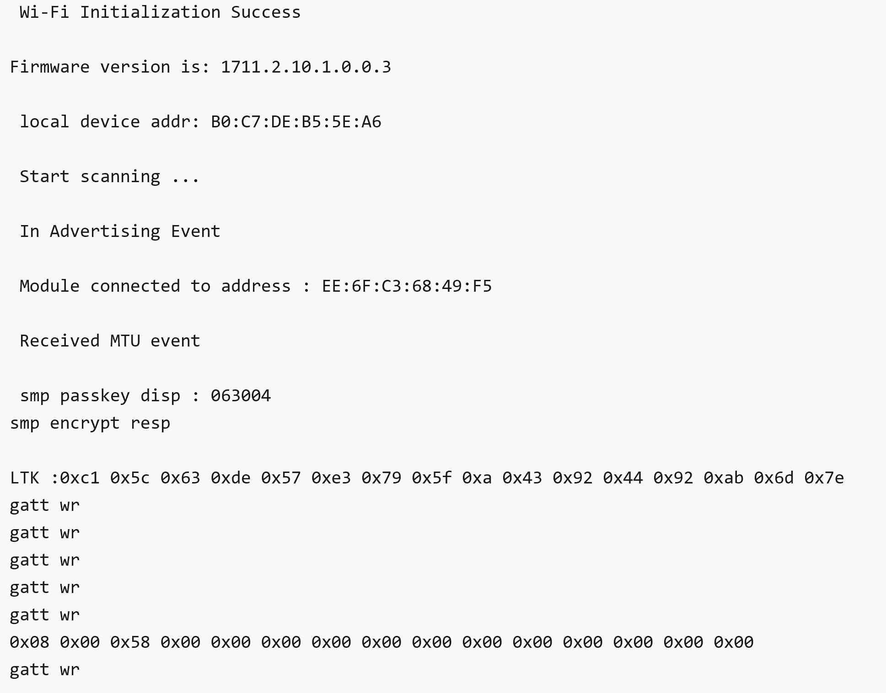
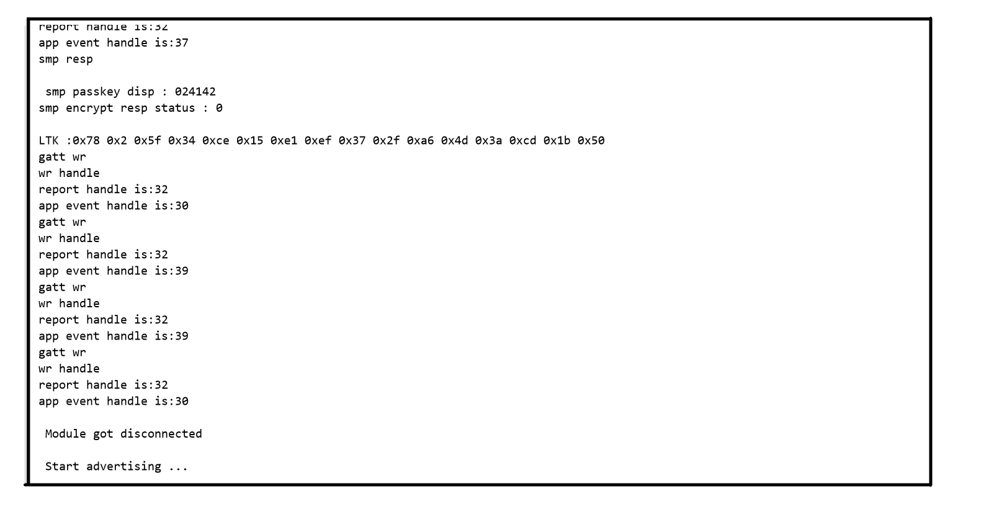
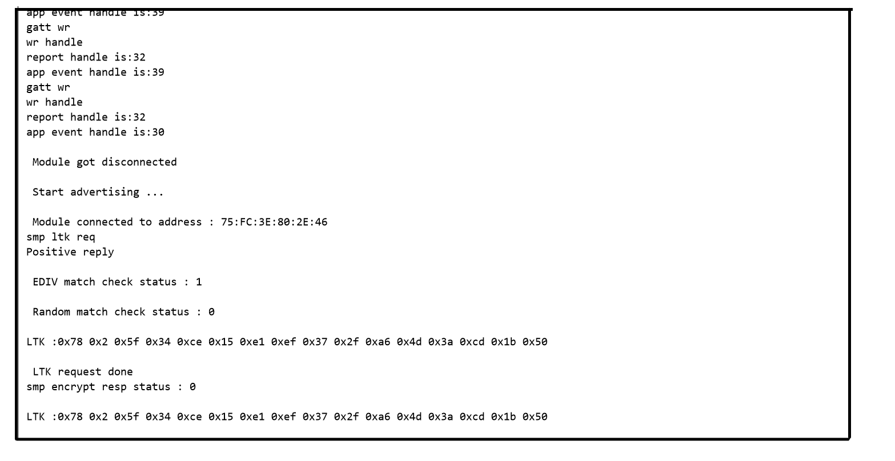

# HID on GATT

## 1. Purpose / Scope

This application demonstrates how to configure SiWx91x EVK as GATT server in BLE peripheral mode and as GATT client in BLE central mode, and provides details of how to do read, notify and indicate operations with GATT server from connected remote device using GATT client and details of getting GATT information from remote GATT server in case of our module as client. 

HID (Human Interface Device) Service GATT server configures with HID service with notification characteristic UUID. When connected remote device writes data to writable characteristic UUID, module receives the data which is received on writable characteristic UUID and writes the same data to readable characteristic UUID and sends notifications to the connected device (or) remote device can read the same data using read characteristic UUID if notification enabled on client side.

HID Service GATT client will get HID service (primary service) , Report Map (characteristic service), and descriptors(client characteristic configuration and report reference) information from the remote GATT server. If remote device supports notify, our module will enable notify property and will be notified by the remote GATT server when value changed.

## 2. Prerequisites / Setup Requirements

Before running the application, the user will need the following things to setup.

### 2.1 Hardware Requirements

- Windows PC with Host interface(UART/ SPI/ SDIO).
  - SiWx91x Wi-Fi Evaluation Kit. The SiWx91x supports multiple operating modes. See [Operating Modes]() for details.
  - **SoC Mode**: 
    - Silicon Labs [BRD4325A, BRD4325B, BRD4325G](https://www.silabs.com/)
  - **NCP Mode**:
    - Silicon Labs [(BRD4180A, BRD4280B)](https://www.silabs.com/);
    - Host MCU Eval Kit. This example has been tested with:
      - Silicon Labs [WSTK + EFR32MG21](https://www.silabs.com/development-tools/wireless/efr32xg21-bluetooth-starter-kit)

- BLE supported Smart phone with GATT client in case of our module as GATT server
- BLE supported Smart phone with GATT Human Interface Device server  in case of our module as GATT client

### 2.2 Software Requirements
    
- Embedded Development Environment

  - For Silicon Labs EFx32, use the latest version of [Simplicity Studio](https://www.silabs.com/developers/simplicity-studio)- Download and install the Silicon Labs [EFR Connect App](https://www.silabs.com/developers/efr-connect-mobile-app) in the android smart phones for testing BLE applications. Users can also use their choice of BLE apps available in Android/iOS smart phones.

### 2.3 Setup Diagram
   
**SoC Mode :** 

  
**NCP Mode :**   

      
   **Note:** Use default Bluetooth application in smart phones which has BLE support.
   
## 3. Project Environment

Ensure the SiWx91x loaded with the latest firmware following the [Getting started with a PC](https://docs.silabs.com/rs9116/latest/wiseconnect-getting-started)

### 3.1 Create the Project

#### 3.1.1 SoC Mode

1. Ensure the SiWx91x setup is connected to your PC.

- In the Simplicity Studio IDE, the SiWx91x SoC board will be detected under **Debug Adapters** pane as shown below.

   
   
- Studio should detect your board. Your board will be shown here. Click on the board detected and go to **EXAMPLE PROJECTS & DEMOS** section.  

- Filter for Bluetooth examples from the Gecko SDK added. For this, check the *Bluetooth* checkbox under **Wireless Technology** and select *BLE - HID On GATT* application.

   

- Click 'Create'. The "New Project Wizard" window appears. Click 'Finish'

  

#### 3.1.2 NCP Mode

1. Ensure the EFx32 and SiWx91x setup is connected to your PC.

- In the Simplicity Studio IDE, the EFR32 board will be detected under **Debug Adapters** pane as shown below.
   
   

- Ensure the latest Gecko SDK along with the WiSeConnect 3 extension is added to Simplicity Studio.

- Go to the 'EXAMPLE PROJECT & DEMOS' tab and select *BLE - HID On GATT* application.

- Click 'Create'. The "New Project Wizard" window appears. Click 'Finish'.

  

### 3.2 Setup for Application Prints

#### 3.2.1 SoC Mode

  You can use either of the below USB to UART converters for application prints.

1. Setup using USB to UART converter board.

   - Connect Tx (Pin-6) to P27 on WSTK
   - Connect GND (Pin 8 or 10) to GND on WSTK

****

2. Setup using USB to UART converter cable

   - Connect RX (Pin 5) of TTL convertor to P27 on WSTK
   - Connect GND (Pin1) of TTL convertor to GND on WSTK

****

**Tera Term setup - for NCP and SoC modes**

1. Open the Tera Term tool.

 - For SoC mode, choose the serial port to which USB to UART converter is connected and click on **OK**. 

   ****

 - For NCP mode, choose the J-Link port and click on **OK**.
    
   ****

2. Navigate to the Setup → Serial port and update the baud rate to **115200** and click on **OK**.

  ****
 
  ****

## 4 Application Build Environment

### 4.1 Application Configuration Parameters

The application can be configured to suit your requirements and development environment. Read through the following sections and make any changes needed.

**4.1.1** Open `app.c` file and update/modify following macros.

User must update the below parameters

- **GATT_ROLE** refers the role of the Silicon Labs module to be selected.

  - If user configure **SERVER**, Silicon Labs module will act as GATT SERVER, means will add Human Interface Device service profile.

  - If user configure **CLIENT**, Silicon Labs module will act as GATT CLIENT, means will connect to remote GATT server and get services.

```c
  #define GATT_ROLE                                        SERVER 
```

   Valid configurations are SERVER and CLIENT.

- `RSI_BLE_REMOTE_BD_ADDRESS_TYPE` refers address type of the remote device to connect.

```c
  #define RSI_BLE_REMOTE_BD_ADDRESS_TYPE                   RANDOM_ADDRESS 
```

   Valid configurations are RANDOM_ADDRESS and PUBLIC_ADDRESS.

- `RSI_BLE_REMOTE_BD_ADDRESS` refers address of the remote device to connect. Replace this with valid BD address.

```c
  #define RSI_BLE_REMOTE_BD_ADDRESS                        "F5:64:91:A2:F6:6F"
```

- `RSI_REMOTE_DEVICE_NAME` refers the name of remote device to which Silicon Labs device has to connect

```c
  #define RSI_REMOTE_DEVICE_NAME                           "Designer Keyboard"
```

   **Note:** User can configure either `RSI_BLE_DEV_ADDR` or `RSI_REMOTE_DEVICE_NAME` of the remote device.
   
   **Power save configuration**

- By default, The Application is configured without power save.

```c 
  #define ENABLE_POWER_SAVE 0```
-   If user wants to run the application in power save, modify the below configuration. 
```c  
  #define ENABLE_POWER_SAVE 1 
```

The desired parameters are provided below. User can also modify the parameters as per their needs and requirements.

- `RSI_BLE_HID_SERVICE_UUID` refers to the attribute value of the newly created service.

```c
  #define RSI_BLE_HID_SERVICE_UUID                         0x1812 
```

- `RSI_BLE_HID_PROTOCOL_MODE_UUID` refers to the attribute type of the first attribute under this above primary service.

```c
#define RSI_BLE_HID_PROTOCOL_MODE_UUID                   0x2A4E
```

- `RSI_BLE_HID_REPORT_UUID` refers to the attribute type of the second attribute under this above primary service.

```c
  #define RSI_BLE_HID_REPORT_UUID                          0x2A4D
``` 

- `RSI_BLE_HID_REPORT_MAP_UUID` refers to the attribute type of the third attribute under this above primary service.

```c


   - `RSI_BLE_HID_INFO_UUID` refers to the attribute type of the fourth attribute under this above primary service.
```c
  #define RSI_BLE_HID_INFO_UUID                            0x2A4A
```   

- `RSI_BLE_HID_CONTROL_POINT_UUID` refers to the attribute type of the fifth attribute under this above primary service.

```c
  #define RSI_BLE_HID_CONTROL_POINT_UUID                   0x2A4C 
```

- `RSI_BLE_APP_HIDS` refers name of the Silicon Labs device to appear during scanning by remote devices.

```c
  #define RSI_BLE_APP_HIDS                                 "HID_OVER_GATT" 
```

**Note:** Following are the non configurable macros related to attribute properties.

```c
  #define RSI_BLE_ATT_PROP_RD                              0x02
  #define RSI_BLE_ATT_PROP_WR_NO_RESP                      0x04
  #define RSI_BLE_ATT_PROP_WR                              0x08
  #define RSI_BLE_ATT_PROP_NOTIFY                          0x10
  #define RSI_BLE_ATT_PROP_INDICATE                        0x20 
```

**Note:** Following are the **non-configurable** macros in the application.

- `RSI_BLE_CHAR_SERV_UUID` refers to the attribute type of the characteristics to be added in a service.

```c
  #define RSI_BLE_CHAR_SERV_UUID                           0x2803```
-   `RSI_BLE_CLIENT_CHAR_UUID` refers to the attribute type of the client characteristics descriptor to be added in a service.
```c    
  #define RSI_BLE_CLIENT_CHAR_UUID                         0x2902
```

- `RSI_BLE_REPORT_REFERENCE_UUID` refers to the attribute type of the report reference descriptor to be added in a service.

```c    
  #define RSI_BLE_REPORT_REFERENCE_UUID                    0x2908
```

**4.1.2** Open `ble_config.h` file and update/modify following macros, #define RSI_BLE_PWR_INX 8
    
   ```c
 #define RSI_BLE_PWR_INX                                  30
 #define RSI_BLE_PWR_SAVE_OPTIONS                         BLE_DISABLE_DUTY_CYCLING 
   ```

   **Opermode command parameters**  

```c
  #define RSI_FEATURE_BIT_MAP                              FEAT_SECURITY_OPEN
  #define RSI_TCP_IP_BYPASS                                RSI_DISABLE
  #define RSI_TCP_IP_FEATURE_BIT_MAP                       TCP_IP_FEAT_DHCPV4_CLIENT 
  #define RSI_CUSTOM_FEATURE_BIT_MAP                       FEAT_CUSTOM_FEAT_EXTENTION_VALID
  #define RSI_EXT_CUSTOM_FEATURE_BIT_MAP                   EXT_FEAT_384K_MODE
```

   **Note:** ble_config.h files are already set with desired configuration in respective example folders user need not change for each example.
   
### 4.2 Build the Application

- Follow the below steps for the successful execution of the application.

#### Build Project - SoC Mode

- Once the project is created, click on the build icon (hammer) to build the project (or) right click on project and click on Build Project.

   
   
- Successful build output will show as below.

#### Build Project - NCP Mode

   

## 5. Test the Application

- Follow the below steps for the successful execution of the application.

### 5.1 Load the SiWx91x Firmware

Refer [Getting started with PC](https://docs.silabs.com/rs9116/latest/wiseconnect-getting-started) to load the firmware into SiWx91x EVK. The firmware binary is located in `<SDK>/firmware/`

### 5.2 Load the Application Image

1. Click on Tools and Simplicity Commander as shown below.

   
   
2. Load the application image
 - Select the board. 
 - Browse the application image (.hex) and click on Flash button.

   

### 5.3 Test Steps
   
**Server Role**

1. After the program gets executed, Silicon Labs module will be in Advertising state.

2. Connect any serial console for prints.

3. Open a default Bluetooth settings and do the scan.

4. In the App, Silicon Labs module will appear with the name configured in the macro **RSI_BLE_APP_HIDS (Ex: "HID_OVER_GATT")** or sometimes observed as Silicon Labs device as internal name "**SimpleBLEPeripheral**".

5. Initiate connection from the Bluetooth settings. It automatically redirects to the pin-code entry pop-up window.

6. Enter the **Pin code** which is displayed in the serial teriminal. 

7. While connection, smart phone will do service discovery and it will find the HID service with UUID **RSI_BLE_HID_SERVICE_UUID.** After that it will read report map and enables the notification.

8. After successful connection, open note pad or any text editor in phone, you can see some text printing.

9. By default, the application is sending some text (i.e., "hog") in regular intervals, which will come as a notification to a smart phone. Use Notepad or Chrome to observe the received data.

**Client Role**

1. Advertise a LE device which supports Human Interface Device Service.

2. After the program gets executed, Silicon Labs module will connect to that remote device based on given BD address.

3. After successful connection Silicon Labs module will read the services from the remote GATT server.

4. If remote device support notify property Silicon Labs module will enable notify, and ready to receive notifications from remote device.

5. Whenever GATT server changes value and notifies that Silicon Labs module will receive that value.

Refer the below images for console prints







