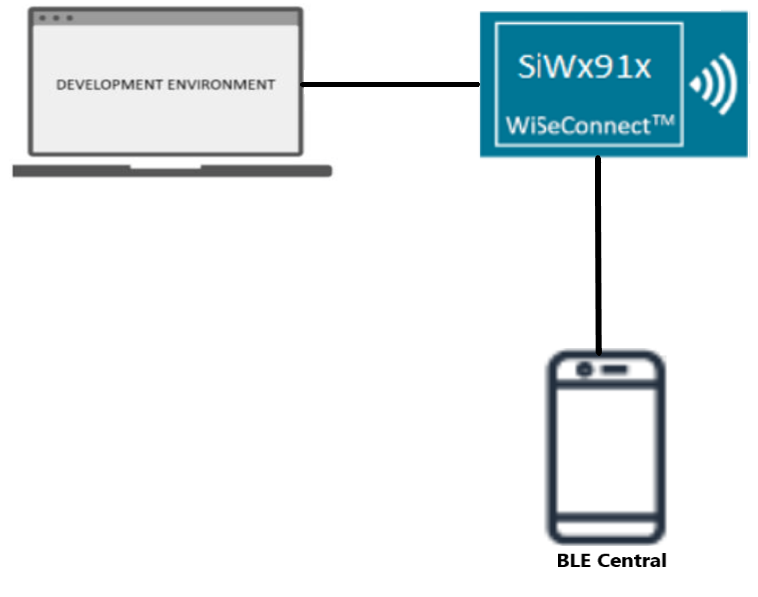
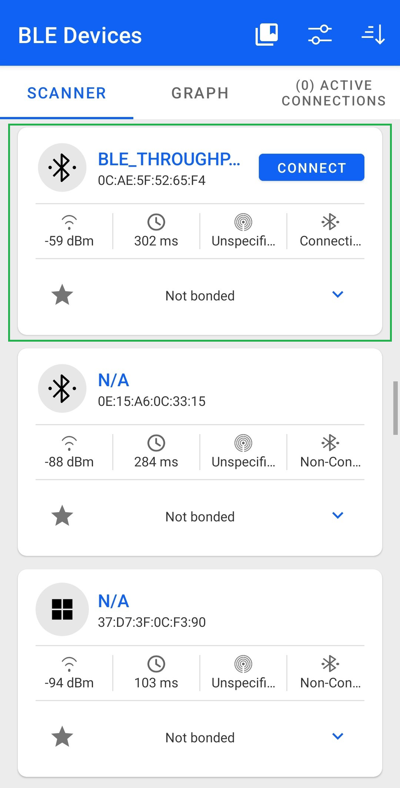
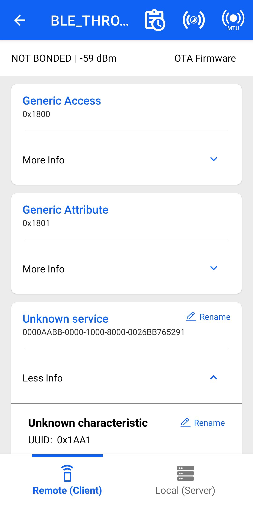
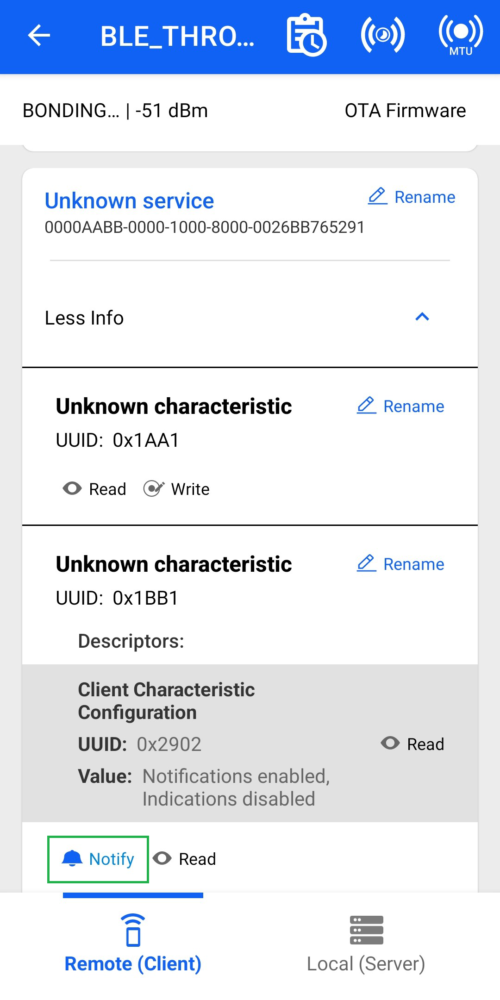
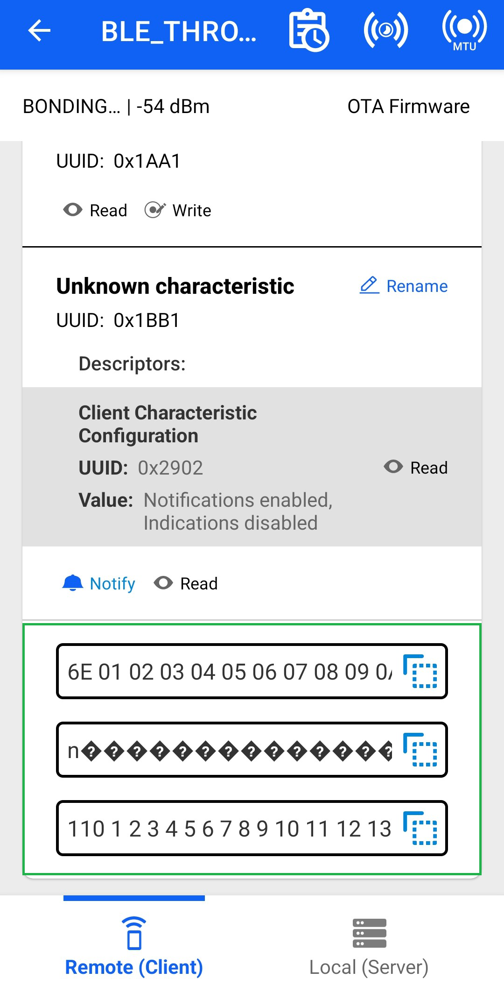
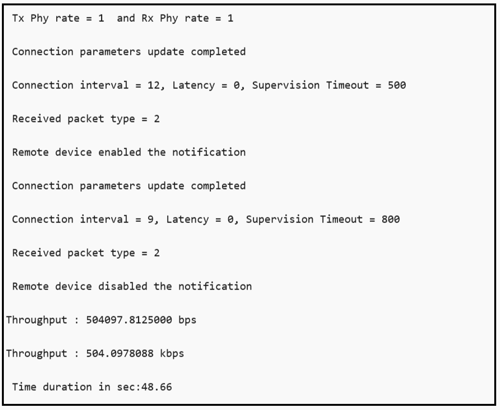

# BLE - Throughput

## Table of Contents

- [Purpose/Scope](#purposescope)
- [Prerequisites/Setup Requirements](#prerequisitessetup-requirements)
  - [Hardware Requirements](#hardware-requirements)
  - [Software Requirements](#software-requirements)
  - [Setup Diagram](#setup-diagram)
- [Getting Started](#getting-started)
- [Application Build Environment](#application-build-environment)
- [Test the Application](#test-the-application)

## Purpose/Scope

This application demonstrates how to exchange continuous data to the remote device to measure the On-Air Throughput using a BLE Sniffer.

- In this Application, the GATT server configures with Custom service with write, read, and notification characteristic UUIDs.
- When connected remote device enables the notification on UUID, Silicon Labs device sends the continuous notifications to the connected device.
- This is data can be captured with Sniffer to measure the throughput.

**Sequence of Events**

This application explains to the user how to:

- Create a Simple chat service
- Make the device advertise / scannable
- Connect from remote BLE device/ Connect to remote BLE device
- Initiate the Security
- Excite the Data length and Phy rate features
- Sends the notification messages to the connected peer/Smartphone when the notification is enabled

## Prerequisites/Setup Requirements

### Hardware Requirements

- Windows PC with Host interface(UART/ SPI/ SDIO).
- SiWx91x Wi-Fi Evaluation Kit. The SiWx91x supports multiple operating modes. See [Operating Modes]() for details.
- **SoC Mode**:
  - Standalone
    - BRD4002A Wireless pro kit mainboard [SI-MB4002A]
    - Radio Boards 
  	  - BRD4338A [SiWx917-RB4338A]
      - BRD4339B [SiWx917-RB4339B]
  	  - BRD4340A [SiWx917-RB4340A]
  - Kits
  	- SiWx917 Pro Kit [Si917-PK6031A](https://www.silabs.com/development-tools/wireless/wi-fi/siwx917-pro-kit?tab=overview)
  	- SiWx917 Pro Kit [Si917-PK6032A]
  	
- **NCP Mode**:
  - Standalone
    - BRD4002A Wireless pro kit mainboard [SI-MB4002A]
    - EFR32xG24 Wireless 2.4 GHz +10 dBm Radio Board [xG24-RB4186C](https://www.silabs.com/development-tools/wireless/xg24-rb4186c-efr32xg24-wireless-gecko-radio-board?tab=overview)
    - NCP EFR Expansion Kit with NCP Radio board (BRD4346A + BRD8045A) [SiWx917-EB4346A]
  - Kits
  	- EFR32xG24 Pro Kit +10 dBm [xG24-PK6009A](https://www.silabs.com/development-tools/wireless/efr32xg24-pro-kit-10-dbm?tab=overview)
    
- **PSRAM Mode**:
    - Silicon Labs [BRD4340A](https://www.silabs.com/)
- BLE peripheral device in case of Silicon Labs module as master.
- BLE central device in case of Silicon Labs module as slave.

### Software Requirements

- Embedded Development Environment
- Simplicity Studio IDE
- Download and install the Silicon Labs [EFR Connect App or other BLE Central/Peripheral app.](https://www.silabs.com/developers/efr-connect-mobile-app) in the android smart phones for testing BLE applications. Users can also use their choice of BLE apps available in Android/iOS smart phones.

### Setup Diagram



## Getting Started

Refer to the instructions [here](https://docs.silabs.com/wiseconnect/latest/wiseconnect-getting-started/) to:

- Install Studio and WiSeConnect 3 extension
- Connect your device to the computer
- Upgrade your connectivity firmware
- Create a Studio project

## Application Build Environment

The application can be configured to suit your requirements and development environment. Read through the following sections and make any changes needed.

- Open `app.c` file and update/modify the following parameters:
	
   - `RSI_BLE_DEVICE_NAME` refers the name of the Silicon Labs device to appear during scanning by remote devices.
   
      ```c    
      #define RSI_BLE_DEVICE_NAME                                  "BLE_THROUGHPUT"
      ```
- Open `rsi_ble_common_config.h` file and update the below parameters.    

   - `RSI_BLE_NEW_SERVICE_UUID` refers to the 16-bit of 128-bit attribute value of the newly created service. 
      ```c
      //128-bit UUID service: 0000AABB-0000-1000-8000-0026BB765291
      #define RSI_BLE_NEW_SERVICE_UUID                                0xAABB
      ```

   - `RSI_BLE_ATTRIBUTE_1_UUID` refers to the attribute type of the first attribute under this service (RSI_BLE_NEW_SERVICE_UUID).
      ```c
      #define RSI_BLE_ATTRIBUTE_1_UUID                                0x1AA1
      ```
   - `RSI_BLE_ATTRIBUTE_2_UUID` refers to the attribute type of the second attribute under this service (RSI_BLE_NEW_SERVICE_UUID).
      ```c
      #define RSI_BLE_ATTRIBUTE_2_UUID                                0x1BB1
      ```
   
  - Following are the **Non-configurable** macros in the application.

    - `RSI_BLE_CHAR_SERV_UUID` refers to the attribute type of the characteristics to be added in a service.

      ```c
      #define RSI_BLE_CHAR_SERV_UUID                            0x2803
      ```

    - `RSI_BLE_CLIENT_CHAR_UUID` refers to the attribute type of the client characteristics descriptor to be added in a service.

      ```c
      #define RSI_BLE_CLIENT_CHAR_UUID                          0x2902
      ```  

    - Following are the properties:

    - `RSI_BLE_ATT_PROPERTY_READ` is used to set the READ property to an attribute value.

      ```c
      #define RSI_BLE_ATT_PROPERTY_READ                         0x02
      ```

    - `RSI_BLE_ATT_PROPERTY_WRITE` is used to set the WRITE property to an attribute value.

      ```c
      #define RSI_BLE_ATT_PROPERTY_WRITE                        0x08
      ```

    - `RSI_BLE_ATT_PROPERTY_NOTIFY` is used to set the NOTIFY property to an attribute value.

      ```c
      #define RSI_BLE_ATT_PROPERTY_NOTIFY                       0x10
      ```

      ```c
      #define RSI_BLE_PWR_INX                                   30
      #define RSI_BLE_PWR_SAVE_OPTIONS                          0
      
      #define RSI_BLE_REMOTE_DEV_ADDR                           "00:12:45:AB:1D:32"
      #define RSI_REMOTE_DEVICE_NAME                            "Note10"
      
      #define CONN_BY_ADDR                                      1
      #define CONN_BY_NAME                                      2

      #define CONNECT_OPTION                                    CONN_BY_NAME
      
      #define CENTERAL_ROLE                                     1
      #define PERIPHERAL_ROLE                                   2
      #define CONNECTION_ROLE                                   PERIPHERAL_ROLE
      
      #define CONN_INTERVAL_MIN                                 45
      #define CONN_INTERVAL_MAX                                 45
      #define CONN_LATENCY                                      0
      #define SUPERVISION_TIMEOUT                               800
      
      #define SMP_ENABLE                                        1
      
      #define TX_LEN                                            0xFB
      #define TX_TIME                                           0x0148
      
      #define TX_PHY_RATE                                       0x02
      #define RX_PHY_RATE                                       0x02
      #define CODDED_PHY_RATE                                   0x00

      #define NOTIFY_DISABLE                                    0x00
      #define NOTIFY_ENABLE                                     0x01
      
      #define DLE_ON                                            1
      
      #define DLE_BUFFER_MODE                                   1
      #define DLE_BUFFER_COUNT                                  25
      #define RSI_BLE_MAX_DATA_LEN                              232
      ```

      > **Note:** `ble_config.h` file is already set with the desired configuration in respective example folders user need not change for each example.

## Test the Application

Refer to the instructions [here](https://docs.silabs.com/wiseconnect/latest/wiseconnect-getting-started/) to:

- Build the application in Studio.
- Flash, run and debug the application.

Follow the steps for successful execution of the program:

1. After the program gets executed, the Silicon Labs module will be in an Advertising state by default.

2. Connect any serial console for prints.

3. Open a nRF Connect App on the Smartphone and do the scan.

4. In the App, the Silicon Labs module device will appear with the name configured in the macro **RSI_BLE_DEVICE_NAME (Ex: "BLE_THROUGHPUT")**

    

5. Initiate a connection from the App.

6. After successful connection, nRF connect APP displays the supported services of Silicon Labs module.

    

7. Select the attribute service which is added **RSI_BLE_NEW_SERVICE_UUID**
   **(Ex: 0xAABB)**
   
8. After Enable notifications for the read attribute **RSI_BLE_ATTRIBUTE_2_UUID**
   **(Example: 0x1BB1) So that the GATT server notifies when value updated in that particular attribute.**

   

9. Please refer to the given following images for continuous notification received on the mobile.

    

10. Refer the below image for console prints.

Debugger prints for 2Mbps:

  

  

Debugger prints for 1Mbps

  

  
