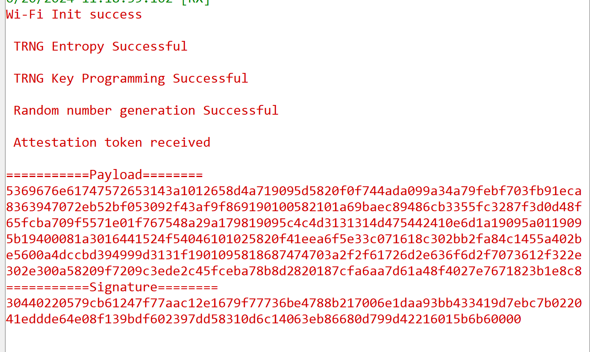

# Crypto - Attestation

## Table of Contents

- [Purpose/Scope](#purposescope) 
- [Prerequisites/Setup Requirements](#prerequisitessetup-requirements)
  - [Hardware Requirements](#hardware-requirements)
  - [Software Requirements](#software-requirements)
  - [Setup Diagram](#setup-diagram)
- [Getting Started](#getting-started)
- [Application Build Environment](#application-build-environment)
- [Test the Application](#test-the-application)

## Purpose/Scope

- This application demonstrates how to send a token request to TA and receive the response token.
- This application can be used by the user for checking the authenticity of the device.
- This application sends a nonce of 32 byte. This nonce is generated using TRNG.
- This application receives the token which is signed using Attestation private key.
- This application then decodes the token using t_cose and QCBOR libraries.

## Prerequisites/Setup Requirements

### Hardware Requirements

  - Windows PC 
  - Silicon Labs [Si917 Evaluation Kit WSTK]
 
 ### Software Requirements
  - Si91x SDK
  - Embedded Development Environment
    - For Silicon Labs Si91x, use Keil Version 5

### Setup Diagram

#### SoC Mode

  

## Getting Started

Refer the instructions [here](https://docs.silabs.com/wiseconnect/latest/wiseconnect-getting-started/) to:

- Install Studio and WiSeConnect 3 extension
- Connect your device to the computer
- Upgrade your connectivity firmware
- Create a Studio project

For details on the project folder structure, see the [WiSeConnect Examples](https://docs.silabs.com/wiseconnect/latest/wiseconnect-examples/#example-folder-structure) page.

## Application Build Environment

- Configure the following parameters in rsi_attestation_app.h file and update/modify following macros if required

   ```c
   #define LENGTH_OF_RANDOM_DATA        // Length of nonce to be sent along with the attestation request
   #define LENGTH_OF_TOKEN              // Length of token to be received
   ```

## Test the Application

Refer to the instructions [here](https://docs.silabs.com/wiseconnect/latest/wiseconnect-getting-started/) to:

- Build the application.
- Flash, run and debug the application.

## Application Output
- Sample output


Follow the steps as mentioned for the successful execution of the application:

1. When the application runs,It sends a token request along with 32 byte nonce and receives the token. 
2. User will get the token along with the nonce that was sent in verify_data buffer present in t_cose_verify.c file and same data get printed with payload and signature data on the UART console
3. Payload data and signature data should to copied in two separate files using hex editor and run the below command for signature verification

   openssl dgst -sha256 -verify <Attestation_pubkey.pem> -signature <signature file> <payload file>
