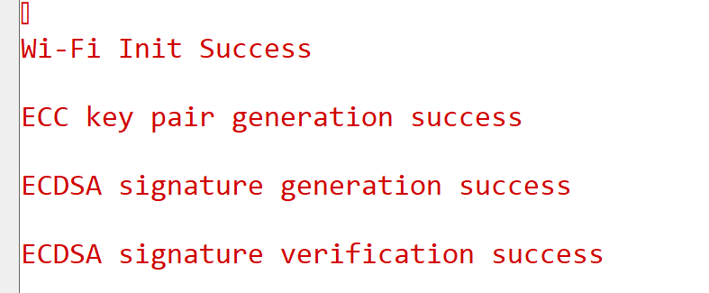

# Crypto - ECDSA

## Table of Contents

- [Purpose/Scope](#purposescope) 
- [Prerequisites/Setup Requirements](#prerequisitessetup-requirements)
  - [Hardware Requirements](#hardware-requirements)
  - [Software Requirements](#software-requirements)
  - [Setup Diagram](#setup-diagram)
- [Getting Started](#getting-started)
- [Application Build Environment](#application-build-environment)
- [Test the Application](#test-the-application)

## Purpose/Scope

This application explains how to configure and use the ECDSA crypto APIs.

## Prerequisites/Setup Requirements

### Hardware Requirements

- Windows PC
- SoC Mode:
  - Silicon Labs [BRD4338A](https://www.silabs.com/)
- For the Wrap Key feature of this application to work, the keys should be programmed and secure boot (ta_secure_boot) should be enabled in the device

### Software Requirements

- Simplicity Studio IDE

### Setup Diagram

#### SoC Mode 

  

## Getting Started

Refer the instructions [here](https://docs.silabs.com/wiseconnect/latest/wiseconnect-getting-started/) to:

- Install Studio and WiSeConnect 3 extension
- Connect your device to the computer
- Upgrade your connectivity firmware
- Create a Studio project

For details on the project folder structure, see the [WiSeConnect Examples](https://docs.silabs.com/wiseconnect/latest/wiseconnect-examples/#example-folder-structure) page.

## Application Build Environment

The application can be configured to suit your requirements and development environment. Read through the following sections and make any changes needed.

Open `app.c` and configure the following parameters accordingly

- The length of the input message can be configured by using the macro INPUT_MSG_SIZE

- The input parameters for `sl_si91x_ecdsa` are configured using these macros

curve_id
  SL_SI91X_ECC_SECP224R1
  SL_SI91X_ECC_SECP256R1

sha_mode
  SL_SI91X_SHA_256
  SL_SI91X_SHA_384
  SL_SI91X_SHA_512

| curve ID | SHA mode |
|--------------- | ------------------|
| SL_SI91X_ECC_SECP224R1 | SL_SI91X_SHA_256 |
| SL_SI91X_ECC_SECP256R1 | SL_SI91X_SHA_384 |
| Note: All the mentioned curves are compatible with all mentioned SHA modes | SL_SI91X_SHA_512 |

- The private key length and public key length can be changed using these macros SL_SI91X_PRIVATE_KEY_SIZE,  SL_SI91X_PUBLIC_KEY_SIZE and the values corresponding to the following curves are

| Macro | Size |
|---------------| ------------------|
| SL_SI91X_PRIVATE_KEY_SIZE | 28 |
| SL_SI91X_PUBLIC_KEY_SIZE | 57 |

  | Macro | Size |
|---------------| ------------------|
| SL_SI91X_PRIVATE_KEY_SIZE | 32 |
| SL_SI91X_PUBLIC_KEY_SIZE | 65 |

- To use wrapped private key in ECDSA operation, enable wrap mode by setting the macro USE_WRAPPED_KEYS to 1

## Test the Application

Refer to the instructions [here](https://docs.silabs.com/wiseconnect/latest/wiseconnect-developers-guide-developing-for-silabs-hosts/) to:

- Build the application.
- Flash, run and debug the application.

## Application Output

  
