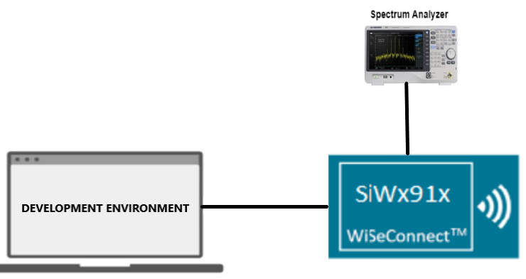
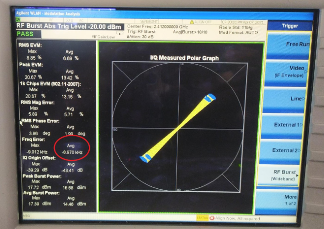

# Wi-Fi - Calibration App

- [Purpose/Scope](#purposescope)
- [Prerequisites/Setup Requirements](#prerequisitessetup-requirements)
  - [Hardware Requirements](#hardware-requirements)
  - [Software Requirements](#software-requirements)
  - [Setup Diagram](#setup-diagram)
- [Getting Started](#getting-started)
- [Application Build Environment](#application-build-environment)
- [Test the Application](#test-the-application)
  - [Spectrum Analyzer Settings](#spectrum-analyzer-settings)
  - [Acronyms and Abbreviations](#acronyms-and-abbreviations)

## Purpose/Scope

This application demonstrates the procedure to calibrate the carrier frequency offset, Tx gain offset and few more parameters and update them to the Flash/Efuse. Customers need to calibrate these two parameters on their platforms after chip integration.

## Prerequisites/Setup Requirements

### Hardware Requirements

- A Windows PC.
- SiWx91x Wi-Fi Evaluation Kit. The SiWx91x supports multiple operating modes. See [Operating Modes](https://www.silabs.com) for details.
- **SoC Mode**:
  - Standalone
    - BRD4002A Wireless pro kit mainboard [SI-MB4002A]
    - Radio Boards 
  	  - BRD4338A [SiWx917-RB4338A]
      - BRD4339B [SiWx917-RB4339B]
  	  - BRD4340A [SiWx917-RB4340A]
  - Kits
  	- SiWx917 Pro Kit [Si917-PK6031A](https://www.silabs.com/development-tools/wireless/wi-fi/siwx917-pro-kit?tab=overview)
  	- SiWx917 Pro Kit [Si917-PK6032A]
  	
- **NCP Mode**:
  - Standalone
    - BRD4002A Wireless pro kit mainboard [SI-MB4002A]
    - EFR32xG24 Wireless 2.4 GHz +10 dBm Radio Board [xG24-RB4186C](https://www.silabs.com/development-tools/wireless/xg24-rb4186c-efr32xg24-wireless-gecko-radio-board?tab=overview)
    - NCP EFR Expansion Kit with NCP Radio board (BRD4346A + BRD8045A) [SiWx917-EB4346A]
  - Kits
  	- EFR32xG24 Pro Kit +10 dBm [xG24-PK6009A](https://www.silabs.com/development-tools/wireless/efr32xg24-pro-kit-10-dbm?tab=overview)
  - Spectrum Analyzer
  - RF Cable connects between EVK and Spectrum Analyzer.

### Software Requirements

- Simplicity Studio

### Setup Diagram



## Getting Started

Refer to the instructions [here](https://docs.silabs.com/wiseconnect/latest/wiseconnect-getting-started/) to:

- Install Studio and WiSeConnect 3 extension
- Connect your device to the computer
- Upgrade your connectivity firmware
- Create a Studio project

## Application Build Environment

The application can be configured to suit user requirements and development environment. Read through the following sections and make any changes needed.

1. In the Project explorer pane, expand the **config** folder and open the **sl_net_default_values.h** file. Configure the following parameters to enable your Silicon Labs Wi-Fi device to connect to your Wi-Fi network.

- DEFAULT_WIFI_CLIENT_PROFILE_SSID refers to the name with which the SiWx91x SoftAP's Wi-Fi network shall be advertised.

  ```c
  #define DEFAULT_WIFI_CLIENT_PROFILE_SSID               "YOUR_AP_SSID"      
  ```

- DEFAULT_WIFI_CLIENT_CREDENTIAL refers to the secret key if the Access point is configured in WPA-PSK/WPA2-PSK security modes.

  ```c
  #define DEFAULT_WIFI_CLIENT_CREDENTIAL                 "YOUR_AP_PASSPHRASE" 
  ```

- DEFAULT_WIFI_CLIENT_SECURITY_TYPE refers to the security type of the Access point. The supported security modes are mentioned in `sl_wifi_security_t`.

  ```c
  #define DEFAULT_WIFI_CLIENT_SECURITY_TYPE SL_WIFI_WPA_WPA2_MIXED
  ```

- Other STA instance configurations can be modified if required in `default_wifi_client_profile` configuration structure. 

2. Configure the following parameters in **app.c** to test calibration app as per requirements

```c
  sl_wifi_data_rate_t rate = SL_WIFI_DATA_RATE_1;
  sl_si91x_request_tx_test_info_t tx_test_info = {
    .enable      = 1,          // Enable/disable tx test mode
    .power       = 18,         // Tx RF power in the range [2:18] dBm
    .rate        = rate,      // WLAN data rate of 6Mbps
    .length      = 30,        // Tx packet length in the range [24:1500] bytes in burst mode, 
    .mode        = 0,         // Selects burst mode or continuous mode
    .channel     = 1,         // Channel number in 2.4 or 5 GHz
    // Other configurable parameters
  }
```

    The different values of mode:
      0 - Burst Mode
      1 - Continuous Mode
      2 - Continuous wave Mode (non modulation) in DC mode
      3 - Continuous wave Mode (non modulation) in single tone mode (center frequency -2.5MHz)
      4 - Continuous wave Mode (non modulation) in single tone mode (center frequency +5MHz)

## Test the application

Refer to the instructions [here](https://docs.silabs.com/wiseconnect/latest/wiseconnect-getting-started/) to:

- Build the application.
- Flash, run and debug the application

1. Make connections as per setup diagram (above) and set the appropriate settings on the Spectrum Analyzer by using the steps mentioned in below **Spectrum Analyzer Settings**.

2. After the program gets executed, the SiWx91x device will start the transmit test with the given configuration.

3. Refer the below image which shows when SiWx91x device transmits packets in Burst mode with different Tx power and different transmission rates in channel 1 with length 30bytes.

   ```sh 
    sl_wifi_data_rate_t rate = SL_WIFI_DATA_RATE_1;
    sl_si91x_request_tx_test_info_t tx_test_info = {
      .enable      = 1,          // Enable/disable tx test mode
      .power       = 18,         // Tx RF power in the range [2:18] dBm
      .rate        = rate,      // WLAN data rate of 6Mbps
      .length      = 30,        // Tx packet length in the range [24:1500] bytes in burst mode, 
      .mode        = 0,         // Selects burst mode or continuous mode
      .channel     = 1,         // Channel number in 2.4 or 5 GHz
      // Other configurable parameters
  }
   ```

4. Observe the Avg Freq Error (highlighted) on the screen and now try to adjust the frequency offset by using CLI commands with serial terminal (Docklight or Teraterm)
   
    

### Frequency Offset Correction

Frequency offset correction will be done by using the sl_si91x_frequency_offset command. This command is used during the RF calibration process and requires PER mode transmissions to be initiated prior. This command sends freq_offset (deviation) as observed on the signal analyzer against the expected channel frequency.

Prototype :  
> `frequency_offset_in_khz = freq_offset_in_khz <CR><LF>`  
> 
> Here freq_offset_in_khz means Frequency deviation in KHz or ppm
   
Examples :
> `frequency_offset_in_khz=10<CR><LF>`
>
> `frequency_offset_in_khz=-10<CR><LF>` 

> **Note:** User can use the above command for any number of times till it gets tuned to desired frequency offset.

Open the serial terminal (Docklight/TeraTerm tool) and enter the following commands. User can provide input to correct frequency offset by sending the commands on console. This should lead towards a correction in the frequency offset as observed earlier and repeat till the error is within the tolerance limits (+/- 2 KHz tolerance limits).

See the below picture after frequency offset correction.

  

> **Note:** freq_offset_in_khz can be either +ve or -ve. When user enters the freq offset as observed on signal analyzer (+ve/-ve), a small freq offset correction is done. User needs to iterate this till the freq offset is within tolerance limits.

### Gain Offset Correction

#### Update XO Ctune and Gain Offset

Using sl_si91x_calibration_write command the calibrated XO Ctune and calculated gain offset can be updated to target memory (Flash/Efuse).

   ```sh
   Prototype :
   sl_si91x_calibration_write = <sl_si91x_calib_write_t calib_write> 
   ```

**Structure Members**

   | Parameter  | Description |                 |          |
   | :---       | :---        | :---            | :---     |
   | target     | Value       | Macro         | Description |
   |            |   0         | BURN_INTO_EFUSE | Burns calibration data to EFuse |
   |            |   1         | BURN_INTO_FLASH | Burns calibration data to Flash |
   | flags      |  BIT        | Macro                  | Description |
   |            |   0         |                       |  Reserved for future use
   |            |   1         | BURN_FREQ_OFFSET      | 1 - Update XO Ctune to calibration data 
   |||| 0 - Skip XO Ctune update
   |            |   2         | SW_XO_CTUNE_VALID     | 1 - Use XO Ctune provided as argument to update calibration data  
   |||| 0 - Use XO Ctune value as read from hardware register
   |            |   3         | BURN_XO_FAST_DISABLE  |     Used to apply patch for cold temperature issue (host interface detection) observed on CC0/CC1 modules. \ref appendix
   |            |   4         |  BURN_GAIN_OFFSET_LOW  | 1 - Update gain offset for low sub-band (2 GHz)  
   |||| 0 - Skip low sub-band gain-offset update
   |            |   5         |  BURN_GAIN_OFFSET_MID  | 1 - Update gain offset for mid sub-band (2 GHz)  
   |||| 0 - Skip mid sub-band gain-offset update
   |            |   6         |  BURN_GAIN_OFFSET_HIGH | 1 - Update gain offset for high sub-band (2 GHz)  
   |||| 0 - Skip high sub-band gain-offset update
   |            |   8         |  ENABLE_DPD_CALIB      | 1 - Collect dpd coefficients data   
   |||| 0 - Skip dpd coeffiecients calibration
   |            |   9         |  BURN_DPD_COEFFICIENTS | 1 - Burn dpd coefficients data   
   |||| 0 - Skip dpd coeffiecients calibration
   |            |   31-4      |                        | Reserved for future use
   |gain_offset_low | gain_offset as observed in dBm in channel-1 | |
   |gain_offset_mid | gain_offset as observed in dBm in channel-6 | |
   |gain_offset_high| gain_offset as observed in dBm in channel-11 | |
   | xo_ctune   | This field allows user to directly update xo_ctune value to calibration data bypassing the freq offset loop, valid only when BURN_FREQ_OFFSET & SW_XO_CTUNE_VALID of flags is set. |   | The range of xo_ctune is [0, 255], and the typical value is 80 |
   |

> **Note:** For SiWx917, the user needs to calibrate gain-offset for low sub-band (channel-1), mid sub-band (channel-6), and high sub-band (channel-11) and input the three gain-offsets to this API and set the corresponding flags to validate it. 

> **Precondition:** 
sl_si91x_frequency_offset command needs to be called before this command when xo ctune value from hardware register is to be used. 

Gain offset can be calculated using the following equation :

```text
gain_offset = observed_power_level + cable_loss - configured_power_level
```

Example :

  gain_offset = 14.3 + 1.7 (assuming) - 18 = -2 dBm

For 2 GHz band, the gain offset has to calibrated for three channels, viz. channel-1, channel-6, channel-11. After the three gain offsets are calculated these can be written to Flash using the `sl_si91x_calibration_write` command.

> NOTE : 
> The gain_offset can be negative but not a floating value.
> Once the frequency offset is corrected after multiple tries, sl_si91x_calibration_write commands has to be given once for all to write the values to flash.

The application reads the updated calibration values for verification by using `sl_si91x_calibration_read` command and displays.

### Spectrum Analyzer Settings

**Below are the necessary settings to see Polar Graph Spectrum Analyzer settings**

1. Frequency channel → center frequency→ 2412MHz for channel1.

2. SpanX scale → span→ 50MHz

3. Mode → WLAN → Mode setup → Radio Std → 802.11a/b/g → 802.11 b/g

4. Trigger → RF Burst

The frequency error section shows the error that needs to be adjusted. Using `sl_si91x_frequency_offset` and `sl_si91x_calibration_write` command user should be able to adjust the frequency error.

### Acronyms and Abbreviations

| Acronym   | Description |
| :----  | :----  | 
| TX      | Transmit       |
|RX | Receive |
|RF | Radio Frequency |
|WLAN | Wireless Local Area Network |
|XO | Crystal Oscillator |
|Ctune| Captune |
|Q7 | Single band SiWx91x EVK |
|A7 | Dual band SiWx91x EVK |

  
