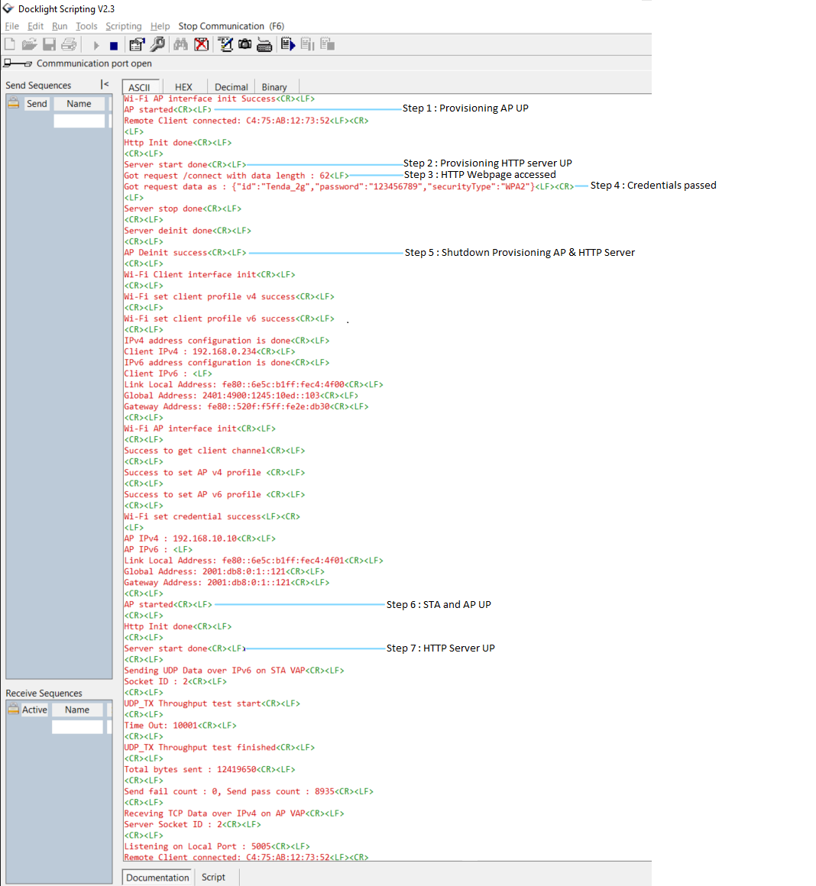
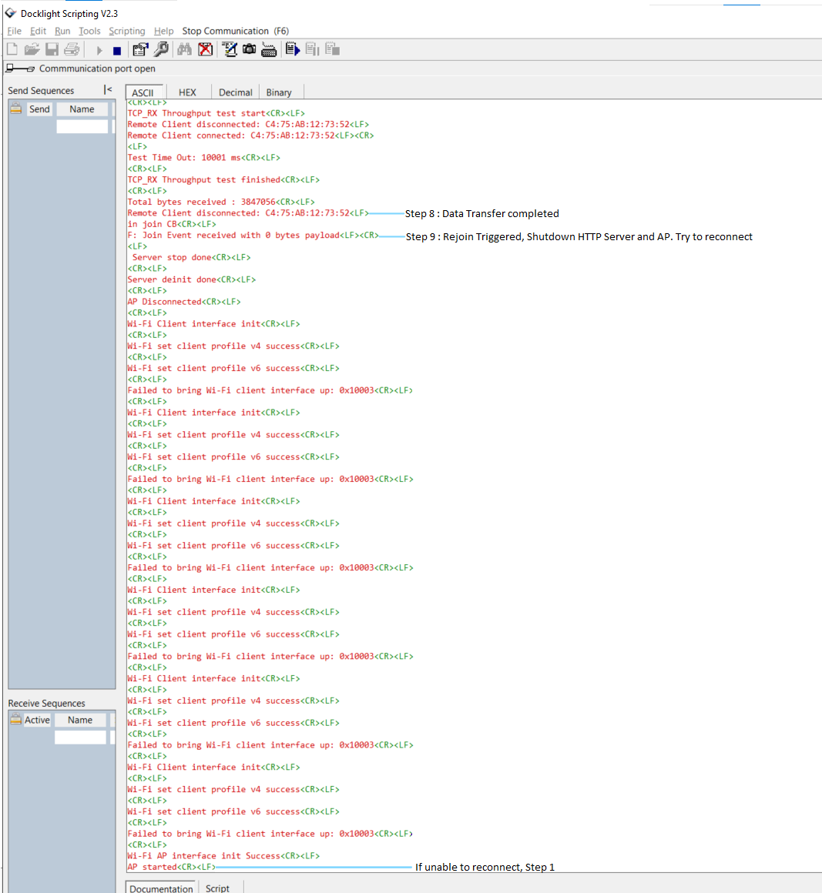

# Wi-Fi - Concurrent HTTP Server Provisioning

## Table of Contents

- [Purpose/Scope](#purposescope)
- [Prerequisites/Setup Requirements](#prerequisitessetup-requirements)
  - [Hardware Requirements](#hardware-requirements)
  - [Software Requirements](#software-requirements)
  - [Setup Diagram](#setup-diagram)
- [Getting Started](#getting-started)
- [Application Build Environment](#application-build-environment)
- [Test the Application](#test-the-application)

## Purpose/Scope

This application demonstrates the setting up of Access Point mode (SoftAP instance) and starting a HTTP server to obtain the SSID, PSK, and SECURITY_TYPE of a third-party AP through an HTTP webpage to configure the SiWx91x in both Wi-Fi Station mode (STA instance) and Access Point mode (SoftAP instance). It showcases support for both IPv4 and IPv6 addressing, along with data transfer capabilities in both modes. If STAUT disconnects, then we pull down the HTTP Server and APUT and restart the process again.

The module opens a socket on the STA VAP and sends the UDPv6 data to the third-party STA connected to the third-party AP. Another listening socket is opened on AP VAP to receive the TCPv4 data from a third-party STA connected to APUT. The HTTP server runs in the background, so the HTTP webpage will be alive throughout the application execution.

![Figure: State Machine Diagram SoC and NCP Mode for Concurrent HTTP Server Provisioning Example] (resources/readme/state_machine_diagram.png)
## Prerequisites/Setup Requirements

### Hardware Requirements

- Windows PC
- Wireless Access Point
- **SoC Mode**:
  - Standalone
    - BRD4002A Wireless pro kit mainboard [SI-MB4002A]
    - Radio Boards 
  	  - BRD4338A [SiWx917-RB4338A]
  - Kits
  	- SiWx917 Pro Kit [Si917-PK6031A](https://www.silabs.com/development-tools/wireless/wi-fi/siwx917-pro-kit?tab=overview)
  	- SiWx917 Pro Kit [Si917-PK6032A]
  	
- **NCP Mode**:
  - Standalone
    - BRD4002A Wireless pro kit mainboard [SI-MB4002A]
    - EFR32xG24 Wireless 2.4 GHz +10 dBm Radio Board [xG24-RB4186C](https://www.silabs.com/development-tools/wireless/xg24-rb4186c-efr32xg24-wireless-gecko-radio-board?tab=overview)
    - EFR32FG25 863-876 MHz +16 dBm Radio Board [FG25-RB4271A](https://www.silabs.com/development-tools/wireless/proprietary/fg25-rb4271a-efr32fg25-radio-board?tab=overview)
    - NCP EFR Expansion Kit with NCP Radio board (BRD4346A + BRD8045A) [SiWx917-EB4346A]
  - Kits
  	- EFR32xG24 Pro Kit +10 dBm [xG24-PK6009A](https://www.silabs.com/development-tools/wireless/efr32xg24-pro-kit-10-dbm?tab=overview)

### Software Requirements

- Simplicity Studio

### Setup Diagram

![Figure: Setup Diagram SoC and NCP Mode for Concurrent HTTP Server Provisioning Example] (resources/readme/concurrent_http_server_provisioning_soc_ncp.png)

**NOTE**:

- The Host MCU platform (EFR32MG21) and the SiWx91x interact with each other through the SPI interface.

## Getting Started

Refer to the instructions [here](https://docs.silabs.com/wiseconnect/latest/wiseconnect-getting-started/) to:

- Install Studio and WiSeConnect 3 extension
- Connect your device to the computer
- Upgrade your connectivity firmware
- Create a Studio project

## Application Build Environment

The application can be configured to suit user requirements and development environment. Read through the following sections and make any changes needed.

- In the Project explorer pane, open the **app.c** file. Configure the following parameters based on your requirements

- Provisioning AP uses DEFAULT_WIFI_AP_PROFILE_SSID.

- STA connected to Provisioning AP should pass the third-party AP credentials.

- STA connected to Provisioning AP should access 192.168.10.10/login.

- Input SSID, PASSWORD, and SECURITY_TYPE(from dropdown).


- **Provisioning AP instance related parameters**

	- WIFI_AP_PROFILE_SSID refers to the SSID of the WiSeConnect concurrent softAP that would be created.

  	```c
  	#define DEFAULT_WIFI_AP_PROFILE_SSID                   "MY_AP_SSID"
  	```

	- WIFI_AP_CREDENTIAL refers to the secret key of the WiSeConnect concurrent softAP that would be created.

  	```c
  	#define DEFAULT_WIFI_AP_CREDENTIAL                     "MY_AP_PASSPHRASE"

  	```c
  	#define HTTP_SERVER_PORT 80
  	```

- **STA instance related parameters**

- STA instance configurations can be modified if required in the `wifi_client_profile_4` and `wifi_client_profile_6` configuration structures in app.c .

- **AP instance related parameters**

	- WIFI_AP_PROFILE_SSID refers to the SSID of the WiSeConnect concurrent softAP that would be created.

  	```c
  	#define WIFI_AP_PROFILE_SSID                   "MY_DUAL_AP_SSID"
  	```

	- WIFI_AP_CREDENTIAL refers to the secret key of the WiSeConnect concurrent softAP that would be created.

  	```c
  	#define WIFI_AP_CREDENTIAL                     "MY_AP_PASSPHRASE"
    ```
- Other AP instance configurations can be modified if required in the `wifi_ap_profile_4` and `wifi_ap_profile_6` configuration structures.

> Note:
>
> 1. In concurrent mode, STA and AP should be configured on the same channel. The STA instance shall first scan for the specified external AP, wherein the channel number of AP is fetched and passed as an argument during SoftAP creation.
> 2. Valid values for CHANNEL_NO are 1 to 11 in 2.4GHz band and 36 to 48 & 149 to 165 in 5GHz. In this example, the default configured band is 2.4GHz.


> Note:
>
> 1. This application provides the facility to configure the Access Point’s IP Parameters. The IPv4 address for the Silicon Labs Access point is **192.168.10.10** and the IPv6 address for the Silicon Labs Access point is **2001:db8:0:1::121**
> 2. In concurrent mode, the IP networks of Silicon Labs STA and Silicon Labs Access Point should both be different. Configure Wireless Access Point IP network (Ex: 192.168.0.1) other than Silicon Labs Access point IP network.

#### Open **sl_wifi_device.h** file. User can also refer the `sl_wifi_default_concurrent_v6_configuration` and can modify/create configurations as per their needs and requirements
>
> Note:
>
> - In `sl_wifi_default_concurrent_v6_configuration`, `oper_mode` must be `SL_SI91X_CONCURRENT_MODE` for this example.

#### Configure the following parameters in **app.c** to test throughput app as per requirements

- **Client/Server IP Settings**

    ```c
    #define LISTENING_PORT     <local_port>       // Local port to use
    #define SERVER_PORT        <remote_port>      // Remote server port
    #define SERVER_IP		   "2401:4290:1245:11ed::4"    // Remote 

- **Data Transfer Test options**

    ```c
    #define BYTES_TO_SEND     (1 << 29)     // To measure TX throughput
    #define TEST_TIMEOUT      10000         // Throughput test timeout in ms

## Test the Application

Refer to the instructions [here](https://docs.silabs.com/wiseconnect/latest/wiseconnect-getting-started/) to:

- Build the application.
- Flash, run, and debug the application.

**Step 1** : Provisioning AP will be brought up.

**Step 2** : Users need to connect to APUT, open the 192.168.10.10/login webpage, and pass the third-party AP credentials.

**Step 3** : Module will be brought up as STA + AP. Data transfer on STA VAP is performed on SERVER_PORT.

**Step 4** : Users need to connect to the AP and send data on the AP VAP.

**Step 5** : Users can change the SSID, PSK, or CH_NO of the third-party AP to trigger rejoin failure.

When data transfer occurs, communication happens between the client-side and the server-side. Typically, it's recommended to initiate the server first, as the client immediately attempts to establish a connection to transmit data.

The following sections describe how to run the SiWx91x application together with examples for UDP and TCP Iperf configurations that run on the PC.

### UDP Tx on IPv6

To use IPv6 UDP Tx, configure the SiWx91x as a UDP client and start a UDP server on the remote PC.
The Iperf command to start the UDP server on the PC is:

> `C:\> iperf.exe -s -u -V -p <SERVER_PORT> -i 1`
>
> For example ...
>
> `C:\> iperf.exe -s -u -V -p 5000 -i 1`

### TCP Rx on IPv4

To use TCPv4 Rx, configure the SiWx91x as a TCP server and start a TCP client on the remote PC.
The Iperf command to start the TCP client is:

> `C:\> iperf.exe -c <Module_IP>-p <module_PORT> -i 1 -t <time interval in sec>`
>
> For example ...
>
> `C:\> iperf.exe -c 192.168.10.10 -p 5005 -i 1 -t 30`

The SiWx91x, which is configured as a UDP/TCP server/client, connects to the iperf server/client and sends/receives data at configured intervals. While the module is transmitting/receiving the data, the application prints the total number of bytes sent/received on the serial console.

## Application Output

   
   