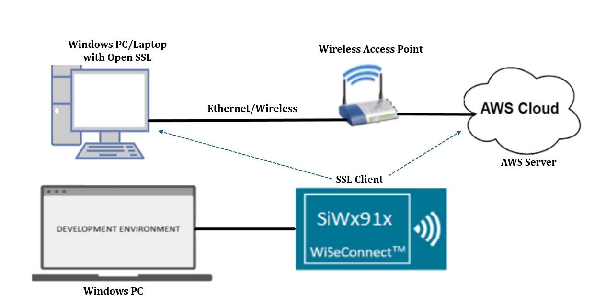
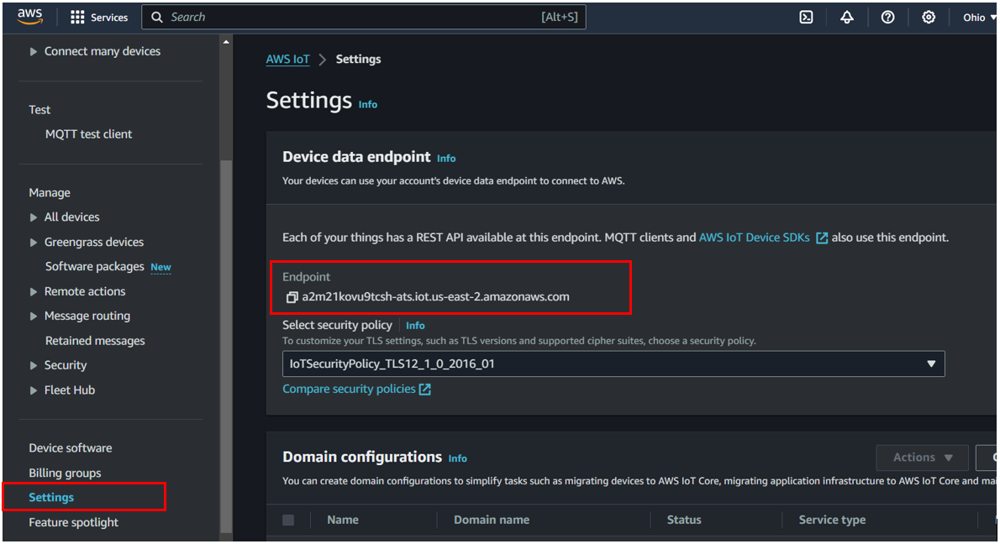
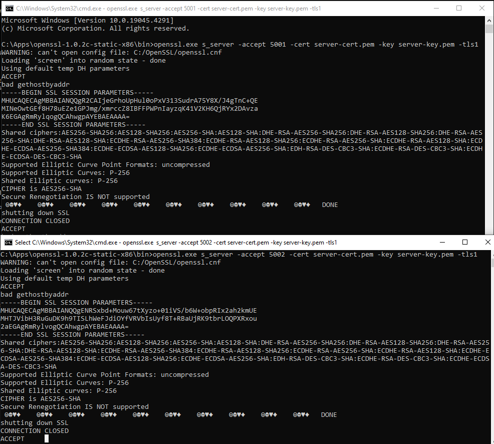
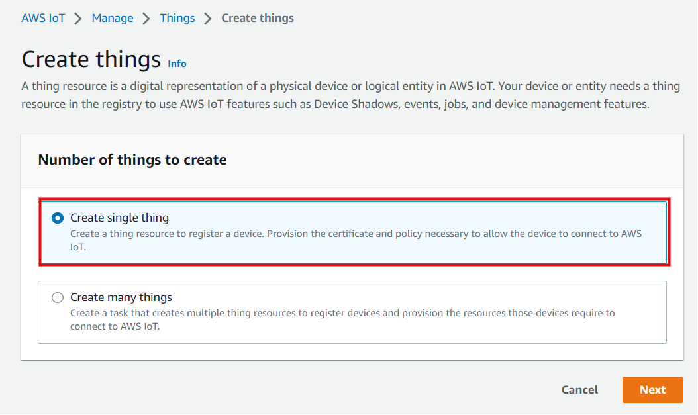

# Wi-Fi - Three TLS Concurrent Client Sockets

## Table of Contents

  - [Purpose/Scope](#purposescope)
  - [Prerequisites/Set up Requirements](#prerequisitesset-up-requirements)
    - [Hardware Requirements](#hardware-requirements)
    - [Software Requirements](#software-requirements)
    - [Setup Diagram](#setup-diagram)
  - [Getting Started](#getting-started)
  - [Application Build Environment](#application-build-environment)
    - [Configure the below parameters in `aws_iot_config.h` file present at `<project>/config`](#configure-the-below-parameters-in-aws_iot_configh-file-present-at-projectconfig)
  - [Test the Application](#test-the-application)
    - [Build and Run the Server](#build-and-run-the-server)
    - [Run the application](#run-the-application)
  - [Additional Information](#additional-information)
    - [Setting up Security Certificates](#setting-up-security-certificates)
    - [Create an AWS Thing](#create-an-aws-thing)

## Purpose/Scope

This application demonstrates how SiWx91x will connect to three different SSL servers with three different set of SSL certificates and loading certificates into the FLASH.

## Prerequisites/Set up Requirements

### Hardware Requirements

- Windows PC
- USB-C cable
- A Wireless Access point (which has an active internet access)

- **SoC Mode**:
  - Standalone
    - BRD4002A Wireless pro kit mainboard [SI-MB4002A]
    - Radio Boards 
  	  - BRD4338A [SiWx917-RB4338A]
      - BRD4342A [SiWx917-RB4342A]
  - Kits
  	- SiWx917 Pro Kit [Si917-PK6031A](https://www.silabs.com/development-tools/wireless/wi-fi/siwx917-pro-kit?tab=overview)
  	- SiWx917 Pro Kit [Si917-PK6032A]
  	
- **NCP Mode**:
  - Standalone
    - BRD4002A Wireless pro kit mainboard [SI-MB4002A]
    - EFR32xG24 Wireless 2.4 GHz +10 dBm Radio Board [xG24-RB4186C](https://www.silabs.com/development-tools/wireless/xg24-rb4186c-efr32xg24-wireless-gecko-radio-board?tab=overview)
 
  - Kits
  	- EFR32xG24 Pro Kit +10 dBm [xG24-PK6009A](https://www.silabs.com/development-tools/wireless/efr32xg24-pro-kit-10-dbm?tab=overview)
  - NCP EFR Expansion Kit with NCP Radio board (BRD8045A + BRD4346A) [SiWx917-EB4346A] 
  
### Software Requirements

- Simplicity Studio.
- [OpenSSL Application](http://ufpr.dl.sourceforge.net/project/gnuwin32/openssl/0.9.8h-1/openssl-0.9.8h-1-bin.zip) in Windows PC (Remote PC).
-  Serial Terminal - [Docklight](https://docklight.de/)/[Tera Term](https://ttssh2.osdn.jp/index.html.en)
-  AWS server information like domain name running in the cloud which supports SSL connection.

### Setup Diagram

  

## Getting Started

Refer to the instructions [here](https://docs.silabs.com/wiseconnect/latest/wiseconnect-getting-started/) to:

- Install Studio and WiSeConnect 3 extension
- Connect your device to the computer
- Upgrade your connectivity firmware
- Create a Studio project
- Setup the console prints

For details on the project folder structure, see the [WiSeConnect Examples](https://docs.silabs.com/wiseconnect/latest/wiseconnect-examples/#example-folder-structure) page.

## Application Build Environment

- In the Project Explorer pane, expand the **config** folder and open the ``sl_net_default_values.h`` file. Configure the following parameters to enable your Silicon Labs Wi-Fi device to connect to your Wi-Fi network

- STA instance related parameters

  - DEFAULT_WIFI_CLIENT_PROFILE_SSID refers to the name with which Wi-Fi network that shall be advertised and Si91X module is connected to it.
 
   ```c
   #define DEFAULT_WIFI_CLIENT_PROFILE_SSID               "YOUR_AP_SSID"      
   ```

  - DEFAULT_WIFI_CLIENT_CREDENTIAL refers to the secret key if the Access point is configured in WPA-PSK/WPA2-PSK security modes.

   ```c
   #define DEFAULT_WIFI_CLIENT_CREDENTIAL                 "YOUR_AP_PASSPHRASE" 
   ```

  - DEFAULT_WIFI_CLIENT_SECURITY_TYPE refers to the security type of the Access point. The supported security modes are mentioned in `sl_wifi_security_t`.

   ```c
   #define DEFAULT_WIFI_CLIENT_SECURITY_TYPE               SL_WIFI_WPA2
   ```
  
- Other STA instance configurations can be modified if required in `default_wifi_client_profile` configuration structure.

- Configure the following parameters in ``app.c`` to test three_ssl_client_sockets app as per requirements  

```c
   #define SERVER_PORT1   <remote port>       // Remote server port
   #define SERVER_PORT2   <remote port>       // Remote server port cloud.
   #define SERVER_PORT3   <remote port>       //  remote peer/ which is running on cloud.   
   #define SERVER_ADDR    "192.168.1.108"     // Remote server IP address
```

- If certificates are not there in flash, then SSL handshake will fail.
  
- AWS_DOMAIN_NAME refers to domain name of the AWS server. To get this refer to the [Configure the below parameters in `aws_iot_config.h` file present at `<project>/config`](#configure-the-below-parameters-in-aws_iot_configh-file-present-at-projectconfig).

```c
   #define AWS_DOMAIN_NAME   "a2m21kovu9tcsh-ats.iot.us-east-2.amazonaws.com"
```

### Configure the below parameters in `aws_iot_config.h` file present at `<project>/config`

> - Before configuring the parameters in `aws_iot_config.h`, register the SiWx917 device in the AWS IoT registry by following the steps mentioned in [Create an AWS Thing](#create-an-aws-thing) section.
>
> - Configure AWS_IOT_MQTT_HOST macro with the device data endpoint to connect to AWS. For getting the device data endpoint in the AWS IoT Console navigate to Settings and copy the Endpoint and define the AWS_IOT_MQTT_HOST macro with this value.
>
>  

```c
#define AWS_IOT_MQTT_HOST "a2m21kovu9tcsh-ats.iot.us-east-2.amazonaws.com"  ///< Customer specific MQTT HOST. The same will be used for Thing Shadow
#define AWS_IOT_MQTT_PORT      8883                 ///< default port for MQTT/S
#define AWS_IOT_MQTT_CLIENT_ID "silicon_labs_thing" ///< MQTT client ID should be unique for every device
#define AWS_IOT_MY_THING_NAME  "silicon_labs_thing" 
```

> - To authenticate and securely connect with AWS, the SiWx917 device requires a unique x.509 security certificate and private key, as well as a CA certificate. At this point, you must be having device certificate, private key and CA certificate which are downloaded during the creation/registration of AWS Thing.
> 
> - By default the certificate and private key that are downloaded from the AWS are in [.pem format](https://en.wikipedia.org/wiki/Privacy-Enhanced_Mail). To load the certificate and private key to the SiWx917, the certificate and private key should be converted into a C-array. For converting the certificates and private key into C-array refer to [Setting up Security Certificates](#setting-up-security-certificates).
>
> - By default the WiSeConnect 3 SDK contains the Starfield Root CA Certificate in C-array format. 

## Test the Application

### Build and Run the Server

Copy the certificates server-cert and server-key into Openssl/bin folder in the Windows PC (Remote PC).

>**NOTE:** All the certificates are given in the SDK. Path: `<SDK>/resources/certificates`

- In Windows PC (Remote PC) which is connected to AP, run the Openssl server by giving the following command.

```c
    > Openssl.exe s_server -accept <SERVER_PORT> -cert <server_certificate_file_path> -key <server_key_file_path> -tls<tls_version>

   Example: openssl.exe s_server -accept 5001 -cert server-cert.pem -key server-key.pem -tls1
```


### Run the application

Refer to the instructions [here](https://docs.silabs.com/wiseconnect/latest/wiseconnect-getting-started/) to

- Build the application.
- Flash, run and debug the application.

- After the program gets executed, SiWx91x would be connected to access point having the configuration same that of in the application and get IP.

- The device which is configured as SSL client will connect to three different remote SSL servers.

  

  
  
## Additional Information

### Setting up Security Certificates

- The WiSeConnect 3 SDK provides a conversion script (written in Python 3) to make the conversion straightforward. The script is provided in the SDK `<SDK>/resources/scripts` directory and is called [certificate_to_array.py](https://github.com/SiliconLabs/wiseconnect-wifi-bt-sdk/tree/master/resources/certificates/).

- Copy the downloaded device certificate, private key from AWS and also the certificate_to_array.py to the `<SDK>/resources/certificates`.

- To convert the device certificate and private key to C arrays, open a system command prompt in the same path and give the following commands.

  ```sh
  $> python3 certificate_to_array.py <input filename> <output arrayname>

  For example:
  $> python3 certificate_to_array.py d8f3a44d3f.pem.crt aws_device_certificate
  $> python3 certificate_to_array.py d8f3a44d3f.pem.key aws_private_key
  ```

- After running the above commands, two new files shall be created as below:

  ```sh
  aws_device_certificate.crt.h
  aws_private_key.key.h
  ```

- After converting the certificate and private key to C - array, it is essential to include the device certificate: aws_device_certificate.crt.h and private key: aws_private_key.key.h in the app.c.

- Ensure to load the certificate and private key to SiWx917 using [sl_net_set_credential()](https://docs.silabs.com/wiseconnect/latest/wiseconnect-api-reference-guide-nwk-mgmt/net-credential-functions#sl-net-set-credential) API.

- Ensure to update the certificate names in the **IoT_Client_Init_Params** structure before calling the **aws_iot_mqtt_init()** API.

- The Starfield Root CA certificate used by your Wi-Fi device to verify the AWS server is already included in the WiSeConnect 3 SDK at `<SDK>/resources/certificates`; no additional setup is required.

> **NOTE :**
> Amazon uses [Starfield Technologies](https://www.starfieldtech.com/) to secure the AWS website, the WiSeConnect SDK includes the [Starfield CA Certificate](https://github.com/SiliconLabs/wiseconnect-wifi-bt-sdk/tree/master/resources/certificates/aws_starfield_ca.pem.h).
>
> For AWS connectivity, StarField Root CA Class 2 certificate has the highest authority being at the top of the signing hierarchy.
>
> The StarField Root CA Class 2 certificate is an expected/required certificate which usually comes pre-installed in the operating systems and plays a key part in certificate chain verification when a device is performing TLS authentication with the IoT endpoint.
>
> On SiWx91x device, we do not maintain the root CA trust repository due to memory constraints, so it is mandatory to load Starfield Root CA Class 2 certificate for successful mutual authentication to the AWS server.
>
> The certificate chain sent by AWS server is as below:
> id-at-commonName=Amazon,id-at-organizationalUnitName=Server CA 1B,id-at-organizationName=Amazon,id-at-countryName=US
> id-at-commonName=Amazon Root CA 1,id-at-organizationName=Amazon,id-at-countryName=US
> id-at-commonName=Starfield Services Root Certificate Authority ,id-at-organizationName=Starfield Technologies, Inc.,id-at-localityName=Scottsdale,id-at- stateOrProvinceName=Arizona,id-at-countryName=US)
>
> On SiWx91x to authenticate the AWS server, firstly Root CA is validated (validate the Root CA received with the Root CA loaded on the device). Once the Root CA validation is successful, other certificates sent from the AWS server are validated.
> SiWx91x doesn't authenticate to AWS server if intermediate CA certificates are loaded instead of Starfield Root CA Class 2 certificate and would result in a Handshake error.
> StarField Root CA Class 2 certificate is at <https://certs.secureserver.net/repository/sf-class2-root.crt>
>
> Reference links :
> <https://aws.amazon.com/blogs/security/how-to-prepare-for-aws-move-to-its-own-certificate-authority/>

### Create an AWS Thing

Create a thing in the AWS IoT registry to represent your IoT device.

- In the [AWS IoT console](https://console.aws.amazon.com/iot/home), in the navigation pane, under Manage, choose All devices, and then choose Things.

  

- If **No things** message is displayed, click on **Create things**.

  

- On the **Create things** page, choose **Create a single thing** and click next.

  

- On the **Specify thing properties** page, enter a name for your IoT thing (for example, **Test_IoT**), and choose **Unnamed shadow (classic)** in the Device Shadow section, then choose **Next**. You can't change the name of a thing after you create it. To change a thing's name, you must create a new thing, give it the new name, and then delete the old thing.

  

- During **Configure device certificate** step, choose **Auto-generate a new certificate (recommended)** option and click next.

  

- Attach the policy to the thing created
  -  If you have any existing policy, attach it and click on create thing

     

  -  If policy is not yet created, follow the below steps.
  
     -   Choose **Create policy** and fill the fields as per your requirements.
     
         

     - Give the **Name** to your Policy, Fill **Action** and **Resource ARN** as shown in below image, Click on **Allow** under **Effect** and click **Create**.
    
       

     - Choose the created policy and click on **Create thing**.

- Choose the **Download** links to download the device certificate and private key. Note that Root CA certificate is already present in SDK (aws_starfield_ca.pem.h), and can be directly used.
  > **Warning:** This is the only instance you can download your device certificate and private key. Make sure to save them safely.

  

- Click **Done**.

- The created thing should now be visible on the AWS console (Manage > All devices > Things).