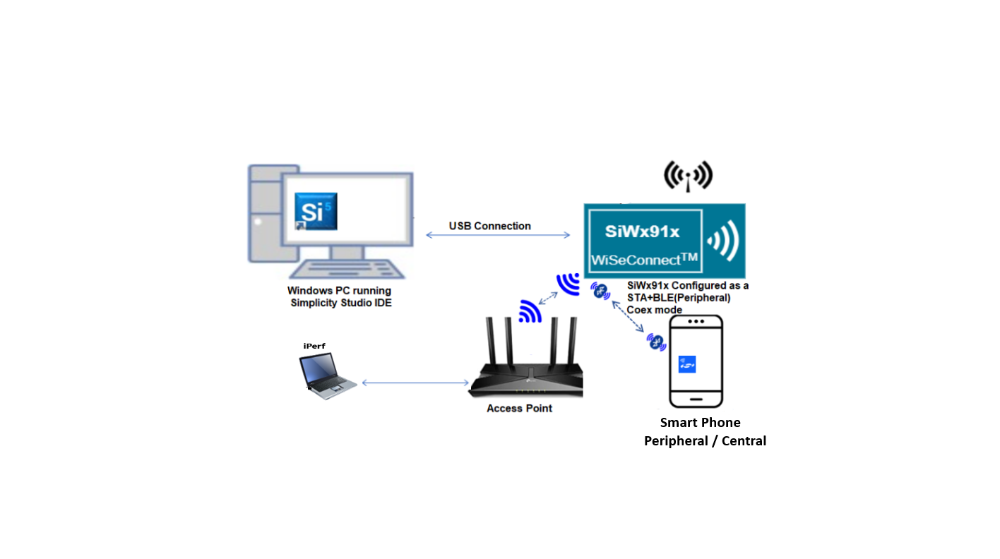

# Wi-Fi Coex - Wi-Fi Client BLE Throughput App

## Table of Contents

- [Purpose/Scope](#purposescope)
- [Prerequisites / Setup Requirements](#prerequisites--setup-requirements)
  - [Hardware Requirements](#hardware-requirements)
  - [Software Requirements](#software-requirements)
  - [Setup Diagram](#setup-diagram)
  - [Getting Started](#getting-started)
- [Application Build Environment](#application-build-environment)
- [Test the Application](#test-the-application)

## Purpose/Scope

The coex application demonstrates throughput measurement of Wi-Fi while BLE is in connection.

The coex application has WLAN and BLE tasks and acts as an interface between Smartphone and PC. Smartphone interacts with BLE task, while Both PC and Silicon Labs device would be connected to a Wireless Access Point, thus both are connected together wirelessly. When Smartphone connects to Silicon Labs device. And data transfer will happen between Station and AP.

## Prerequisites / Setup Requirements

### Hardware Requirements

- Windows PC with Host interface (UART / SPI).
- SiWx91x Wi-Fi Evaluation Kit. The SiWx91x supports multiple operating modes. See [Operating Modes]() for details.
- **SoC Mode**:
  - Standalone
    - BRD4002A Wireless pro kit mainboard [SI-MB4002A]
    - Radio Boards 
  	  - BRD4338A [SiWx917-RB4338A]
      - BRD4339B [SiWx917-RB4339B]
  	  - BRD4340A [SiWx917-RB4340A]
  - Kits
  	- SiWx917 Pro Kit [Si917-PK6031A](https://www.silabs.com/development-tools/wireless/wi-fi/siwx917-pro-kit?tab=overview)
  	- SiWx917 Pro Kit [Si917-PK6032A]
  	
- **NCP Mode**:
  - Standalone
    - BRD4002A Wireless pro kit mainboard [SI-MB4002A]
    - EFR32xG24 Wireless 2.4 GHz +10 dBm Radio Board [xG24-RB4186C](https://www.silabs.com/development-tools/wireless/xg24-rb4186c-efr32xg24-wireless-gecko-radio-board?tab=overview)
    - NCP EFR Expansion Kit with NCP Radio board (BRD4346A + BRD8045A) [SiWx917-EB4346A]
  - Kits
  	- EFR32xG24 Pro Kit +10 dBm [xG24-PK6009A](https://www.silabs.com/development-tools/wireless/efr32xg24-pro-kit-10-dbm?tab=overview)
        
- Wireless Access Point
- Smart phone/tablet with BLE Application (Ex: Light Blue / BLE Connect App)
- Windows PC with iperf and openssl applications.

### Software Requirements

  - Simplicity Studio
  - Download and install iperf from this link [Iperf Application](https://iperf.fr/iperf-download.php).

  - Download and install OpenSSL from this link [OpenSSL](http://ufpr.dl.sourceforge.net/project/gnuwin32/openssl/0.9.8h-1/openssl-0.9.8h-1-bin.zip) to download openssl in remote PC.

  - Download and install the Silicon Labs [EFR Connect App or other BLE Central/Peripheral app.](https://www.silabs.com/developers/efr-connect-mobile-app) in the android smart phones for testing BLE applications. Users can also use their choice of BLE apps available in Android/iOS smart phones.

### Setup Diagram



## Getting Started

Refer to the instructions [here](https://docs.silabs.com/wiseconnect/latest/wiseconnect-getting-started/) to:

- Install Studio and WiSeConnect 3 extension
- Connect your device to the computer
- Upgrade your connectivity firmware
- Create a Studio project

## Application Build Environment

The application can be configured to suit your requirements and development environment. Read through the following sections and make any changes needed.

Open `wifi_app_config.h` file

**Wi-Fi Configuration**

Configure the following parameters to enable your Silicon Labs Wi-Fi device to connect to your Wi-Fi network.

```
#define SSID           "SILABS_AP"      // Wi-Fi Network Name
#define PSK            "1234567890"     // Wi-Fi Password
#define SECURITY_TYPE  SL_WIFI_WPA2     // Wi-Fi Security Type: SL_WIFI_OPEN / SL_WIFI_WPA / RSI_WPA2
```

**Client/Server IP Settings**

```c
#define DEVICE_PORT        <local_port>   // Local port to use
#define SERVER_PORT        <remote_port>  // Remote server port
#define SERVER_IP_ADDRESS  "192.168.0.100"     // Remote server IP address
#define BUF_SIZE 		   1400			  //! Memory length for send buffer
#define SOCKET_ASYNC_FEATURE 1                // Type of Socket used. Synchronous = 0, Asynchronous = 1
```

**Throughput Measurement Types**

The application may be configured to measure throughput using UDP, TCP, SSL packets. Choose the measurement type using the `THROUGHPUT_TYPE` macro.

```
#define THROUGHPUT_TYPE  TCP_TX     // Selects the throughput option; see the following diagrams. 
#define TCP_TX           0			// SiWx91x transmits packets to remote TCP client
#define TCP_RX           1			// SiWx91x receives packets from remote TCP server
#define UDP_TX           2			// SiWx91x transmits packets to remote UDP client
#define UDP_RX           3			// SiWx91x receives packets from remote UDP server
#define SSL_TX 			 4          // SiWx91x transmits packets to remote SSL client
#define SSL_RX           5          // SiWx91x receives packets from remote SSL server
```

To Load certificate to device flash.(Certificate could be loaded once and need not be loaded for every boot up)
   
```
#define  LOAD_CERTIFICATE                         0x01
```

Open `ble_app.c` file and update/modify following macros

RSI_BLE_CHAR_SERV_UUID refers to the attribute type of the characteristics to be added in a service.
   
```
#define  RSI_BLE_CHAR_SERV_UUID                         0x2803
```

RSI_BLE_CLIENT_CHAR_UUID refers to the attribute type of the client characteristics descriptor to be added in a service.
    
```
#define RSI_BLE_CLIENT_CHAR_UUID                        0x2902
```

RSI_BLE_NEW_SERVICE_UUID refers to the attribute value of the newly created service.

```
#define  RSI_BLE_NEW_SERVICE_UUID                       0xAABB
```

RSI_BLE_ATTRIBUTE_1_UUID refers to the attribute type of the first attribute under this service (RSI_BLE_NEW_SERVICE_UUID).

```
#define  RSI_BLE_ATTRIBUTE_1_UUID                        0x1AA1
```

RSI_BLE_ATTRIBUTE_2_UUID refers to the attribute type of the second attribute under this service (RSI_BLE_NEW_SERVICE_UUID).

```
#define RSI_BLE_ATTRIBUTE_2_UUID                         0x1BB1
```
RSI_BLE_MAX_DATA_LEN refers to the Maximum length of the attribute data.

```c
#define RSI_BLE_MAX_DATA_LEN                             20
```

RSI_BLE_APP_DEVICE_NAME refers to the name of the SiWx91x EVK to appear during scanning by remote devices.

```c
#define  RSI_BLE_APP_DEVICE_NAME                         "WLAN_BLE_APP"
```

The following are the **non-configurable** macros in the application.

RSI_BLE_ATT_PROPERTY_READ is used to set the READ property to an attribute value.

```
#define  RSI_BLE_ATT_PROPERTY_READ                       0x02
```

RSI_BLE_ATT_PROPERTY_WRITE is used to set the WRITE property to an attribute value.

```c
#define RSI_BLE_ATT_PROPERTY_WRITE                       0x08
```

RSI_BLE_ATT_PROPERTY_NOTIFY is used to set the NOTIFY property to an attribute value.

```c
#define  RSI_BLE_ATT_PROPERTY_NOTIFY                     0x10
```

## Test the Application

Refer to the instructions [here](https://docs.silabs.com/wiseconnect/latest/wiseconnect-getting-started/) to:

- Build the application.
- Flash, run and debug the application

- Observing the output prints on serial terminal  

  